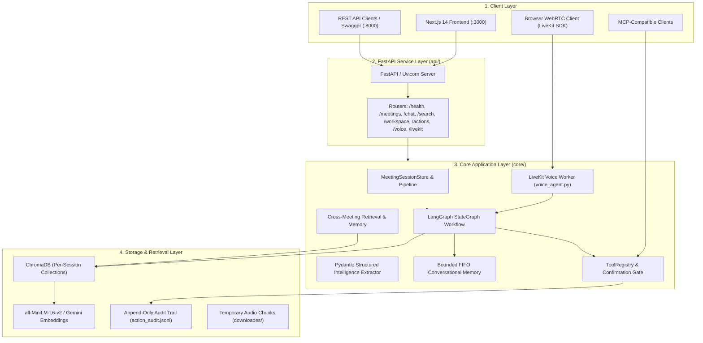
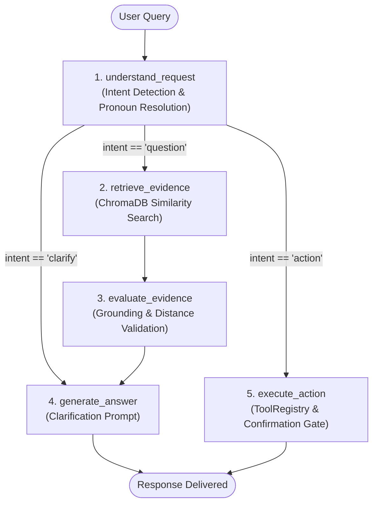

# RecallAI

### AI Meeting & Conversation Intelligence Platform

RecallAI turns meetings and long-form video recordings into searchable, evidence-grounded answers and structured actions. Users can ask questions about discussions, receive responses attributed directly to transcript timestamps, search across multiple meetings, and convert commitments into tracked tasks or calendar events. Built with Next.js 14 and FastAPI, the platform integrates speech-to-text transcription, ChromaDB vector retrieval, LangGraph stateful orchestration, Model Context Protocol (MCP) action tools with human confirmation gates, and real-time LiveKit voice interaction.

[](https://www.python.org/)
[](https://fastapi.tiangolo.com/)
[](https://nextjs.org/)
[](https://www.typescriptlang.org/)
[](https://langchain-ai.github.io/langgraph/)
[](https://www.trychroma.com/)
[](https://ai.google.dev/)
[](https://livekit.io/)
[](https://modelcontextprotocol.io/)
[](https://www.docker.com/)

---

## Why RecallAI?

Standard meeting assistants typically pipe transcripts directly into an LLM for monolithic summarization:

```text
Meeting Audio/Video ──► Speech-to-Text ──► Unstructured LLM Prompt ──► Generic Summary
```

This pattern suffers from critical failure modes in technical and organizational settings:
* **Hallucinated Decisions**: LLMs conflate conversational proposals with confirmed agreements.
* **Lack of Evidence Provenance**: Summaries lack timestamped attribution back to the source recording, requiring tedious manual transcript audits.
* **Stateless Follow-ups**: Follow-up questions fail when referential pronouns or ellipsis are used (*"Who owns it?"*, *"When is that due?"*).
* **Information Silos**: Insights remain trapped within single recordings, making cross-meeting queries and thematic discovery impractical.
* **Unsafe Autonomous Actions**: Agents executing real-world side effects without human review risk sending erroneous emails or creating conflicting calendar events.

RecallAI addresses each failure mode through an explicit, auditable architecture:

```text
Media Ingestion (YouTube / Audio / Video)
      │
      ▼
Silence-Aware STT & Timestamped Segmentation
      │
      ▼
ChromaDB Dense Vector Indexing (Per-Session Isolation)
      │
      ▼
LangGraph Stateful Orchestration
      ├── Conversational Memory (Pronoun & Ellipsis Disambiguation)
      ├── Distance-Filtered Evidence Retrieval ([E1], [E2] Citations)
      ├── Grounded Generation & Deterministic Refusal
      └── MCP Tool Resolution (Tasks, Calendar, Email)
      │
      ▼
Human-in-the-Loop Confirmation Gate (Consequential Action Staging)
      │
      ▼
Action Execution & JSON-Lines Audit Trail
```

---

## What RecallAI Does

| Capability | Description |
|---|---|
| **Multimodal Ingestion** | Ingests YouTube URLs (via `yt-dlp`) and uploaded media files (`.mp3`, `.wav`, `.mp4`, `.m4a`, `.webm`, `.flac`, etc.) with extension and size validation. |
| **Speech-to-Text** | Local OpenAI Whisper (`small` default), Sarvam AI (`saaras:v2.5` for Hindi/Hinglish), and Google Gemini audio transcription. |
| **Grounded RAG** | Per-session ChromaDB vector collections indexed with local `all-MiniLM-L6-v2` dense embeddings or cloud Gemini embeddings. |
| **Evidence Provenance** | Every factual claim references specific transcript evidence blocks (`[E1 · MM:SS]`) with start/end timestamps and clickable navigation. |
| **Conversational Memory** | Disambiguates pronouns and ellipsis follow-ups using a bounded FIFO rolling window (up to 6 turns) per session. |
| **Meeting Intelligence** | Structured extraction of Action Items (with status lifecycle), Confirmed Decisions, and Open Questions into Pydantic v2 schemas. |
| **Workspace Intelligence** | Workspace-wide semantic and structured search across transcripts, tasks, decisions, and dilemmas, plus cross-meeting SSE chat. |
| **MCP Controlled Actions** | Stdio JSON-RPC 2.0 Model Context Protocol server exposing task management, calendar scheduling, and email dispatch tools. |
| **Confirmation Gate** | High-impact actions (`create_calendar_event`, `send_email`) are staged with a 15-minute TTL, requiring explicit human approval. |
| **Real-Time Voice** | Real-time voice interaction powered by LiveKit Agents v1, Silero VAD, Deepgram/Whisper STT, and OpenAI/gTTS speech synthesis. |
| **Offline Demo Mode** | Instant demonstration utilizing a pre-indexed engineering migration meeting fixture without external API keys. |

---

## Architecture



---

## Core AI Pipeline

```text
Media Input (YouTube URL / Audio / Video File)
      │
      ▼
1. Audio Extraction & Normalization (16 kHz Mono 16-bit PCM WAV, -0.5 dBFS peak normalization)
      │
      ▼
2. Acoustic Segmentation (Silence-split chunking within ±5s boundaries to prevent cutting mid-word)
      │
      ▼
3. Speech-to-Text Transcription (Local Whisper / Sarvam AI / Gemini multimodal)
      │
      ▼
4. Text Chunking (RecursiveCharacterTextSplitter: chunk_size=600, overlap=100)
      │
      ▼
5. Dense Vector Embeddings (sentence-transformers/all-MiniLM-L6-v2, 384-dimensional)
      │
      ▼
6. Storage (ChromaDB session collection: meeting_<session_id>)
      │
      ▼
7. Distance-Filtered Retrieval (k=4 candidates, cosine/L2 relevance scoring)
      │
      ▼
8. Grounded Generation (XML-delimited context, mandatory [E1] citation tags, refusal fallback)
```

---

## RAG & Evidence Provenance

RecallAI enforces evidence grounding to attribute answers directly to source transcripts.

### Vector Storage Configuration
* **Chunking Algorithm**: `RecursiveCharacterTextSplitter` with separators `["\n\n", "\n", ". ", "? ", "! ", "; ", ", ", " ", ""]`.
* **Chunk Size & Overlap**: `DEFAULT_CHUNK_SIZE = 600` characters, `DEFAULT_CHUNK_OVERLAP = 100` characters.
* **Embeddings**: `sentence-transformers/all-MiniLM-L6-v2` (384-d, local CPU-optimized) with optional cloud Gemini `models/text-embedding-004` (768-d).
* **Collection Isolation**: ChromaDB collections are keyed to `meeting_<session_id>` (or `meeting_<session_id>_gemini_<slug>`), providing session-specific vector collection isolation.
* **Metadata Preservation**: Every vector chunk stores `chunk_index`, `start_seconds`, `end_seconds`, `time_range`, and `segment_ids`.

### Evidence Citation Format
Every response cites verbatim evidence blocks containing the evidence identifier and timestamp range:

```text
User:
"When is the database migration plan due?"

Assistant:
"Rahul is responsible for preparing and distributing the complete PostgreSQL migration plan 
by Friday at 5 PM [E1 · 00:03:25 – 00:04:00]."

Cited Evidence:
[E1] 00:03:25 – 00:04:00 (Chunk #2)
"Rahul: Yes, I will prepare and distribute the complete PostgreSQL migration plan 
by Friday at 5 PM."
```

If a question asks about topics absent from the recording, the system returns a deterministic refusal:
> *"I could not find this information in the meeting transcript."*

---

## LangGraph Workflow

The assistant conversation turn is orchestrated by an explicit `StateGraph` compiled in `core/workflow.py`:



### Graph Nodes
1. **`understand_request`**: Inspects the user's message, detects whether the intent is a question, action tool request, or clarification, and resolves conversational references using session memory.
2. **`retrieve_evidence`**: Executes similarity search against the session's ChromaDB collection, verifying evidence consistency against the active session ID.
3. **`evaluate_evidence`**: Checks distance thresholds and evidence sufficiency to confirm the query is answerable from transcript content.
4. **`generate_answer`**: Invokes the LLM (Google Gemini with Mistral fallback) with XML-formatted context, formatting `[E1]` citations and enforcing refusal bounds.
5. **`execute_action`**: Routes action tool calls through the `ToolRegistry` and `ConfirmationManager`.

---

## Conversational Memory

RecallAI implements session-isolated conversational memory (`core/memory/memory.py`):

* **Bounded Window**: Retains a bounded FIFO rolling history of conversation turns (up to 6 turns) per session.
* **Pronoun & Ellipsis Resolution**: Uses the `resolve_conversational_query` function to rewrite referential queries into standalone search statements prior to vector retrieval.
* **Session Boundaries**: Memory is keyed to `session_id` and does not bleed into other meetings.

### Follow-Up Example
```text
User:       "Who is responsible for the database migration?"
Assistant:  "Rahul is responsible for preparing the PostgreSQL migration plan [E1]."

User:       "When is it due?"
Assistant:  "The migration plan is due by Friday at 5 PM [E1]."
            (Resolved Query: "When is the PostgreSQL migration plan due?")

User:       "What is the budget for that project?"
Assistant:  "I could not find this information in the meeting transcript."
```

---

## Meeting Intelligence

Structured intelligence is extracted using Pydantic v2 schemas (`core/intelligence/extractor.py`):

### 1. Action Items
* `task` (str): Concrete task description.
* `owner` (Optional[str]): Assigned person, or `None` / `"Unassigned"` if unmentioned.
* `deadline` (Optional[str]): Explicit timeframe, or `None` / `"Not specified"` if unstated.
* `status` (str): `"Open"`, `"In Progress"`, or `"Done"`.
* `evidence` (Optional[str]): Verbatim quote from the transcript establishing the commitment.
* `timestamp` (Optional[str]): Transcript time range.

### 2. Confirmed Decisions
* `decision` (str): Explicitly agreed decision (distinguished from tabled proposals).
* `evidence` (Optional[str]): Source quotation confirming consensus.
* `timestamp` (Optional[str]): Transcript time range.

### 3. Open Questions & Dilemmas
* `question` (str): Unresolved topic, dilemma, or pending dependency.
* `evidence` (Optional[str]): Source context explaining why the item remains open.
* `timestamp` (Optional[str]): Transcript time range.

---

## Workspace Intelligence

Workspace intelligence (`core/retrieval/workspace_rag.py`, `core/memory/workspace_memory.py`) extends analysis across all loaded meetings:

* **Workspace-Wide Semantic & Structured Search** (`GET /api/v1/search`): Searches across all meeting vector collections and structured registers (decisions, tasks, dilemmas) with relevance ranking, returning matches labeled by type (`transcript`, `decision`, `action_item`, `open_question`).
* **Cross-Meeting Conversation Assistant** (`POST /api/v1/workspace/chat` & `/stream`): An SSE streaming assistant that retrieves evidence across multiple sessions, formatting multi-provenance citations: `[E1 · Backend Migration · 01:40]`.
* **Workspace Memory** (`GET /api/v1/workspace/memory`): Aggregates cross-meeting decisions, open actions, unresolved dilemmas, and tracked participants across loaded sessions.

---

## MCP & Controlled Actions

RecallAI implements a Model Context Protocol (MCP) server (`mcp_server/server.py`) operating over stdio JSON-RPC 2.0 (server name: `recallai-meeting-assistant`).

### Registered Tools

| Tool Name | Risk Level | Confirmation Required | Description |
|---|---|---|---|
| `create_task` | Low | No | Creates a task with owner, deadline, and transcript evidence provenance. |
| `list_tasks` | Low | No | Lists tasks for a session with optional filters by owner or status. |
| `create_calendar_event` | Medium | **Yes** | Stages a calendar invitation with start/end datetimes and participant lists. |
| `list_calendar_events` | Low | No | Lists scheduled events for a meeting session. |
| `draft_email` | Low | No | Prepares a structured email draft for user review without sending. |
| `send_email` | High | **Yes** | Stages an email for delivery, requiring explicit confirmation. |

### Human-in-the-Loop Confirmation Gate
To prevent autonomous agents from triggering unintended external consequences:
1. Consequential tools (`create_calendar_event`, `send_email`) are intercepted by the `ConfirmationManager`.
2. The action is held in a `pending` state with an assigned `action_id`, a risk rating, and a preview summary.
3. Pending actions carry a **15-minute TTL** (`default_ttl_seconds = 900.0`), after which they expire automatically.
4. Execution occurs only after explicit confirmation via `POST /api/v1/actions/{action_id}/confirm`.
5. All proposals, confirmations, rejections, and executions are written to an append-only audit trail (`action_audit.jsonl`).

*Note: Tool adapters currently execute locally with schema validation and audit logging; live OAuth integrations (Google Workspace, Microsoft 365) are future extension points.*

---

## Real-Time Voice (LiveKit Agents)

Real-time voice interaction (`voice_agent.py`, `core/voice/pipeline.py`) provides an audio interface directly connected to RecallAI's intelligence layer.

```text
User Microphone
      │ WebRTC
      ▼
LiveKit Room
      │
      ▼
Silero VAD (Turn Detection)
      │
      ▼
Deepgram STT (Optional cloud STT; falls back to local Whisper)
      │
      ▼
RecallAIPipelineAdapter.chat()
      │ delegates to
run_assistant_workflow() [Session Mode]  OR  run_workspace_assistant() [Workspace Mode]
      │
      ▼
prepare_text_for_speech() (Strips citation brackets [E1], removes markdown, bounds length)
      │
      ▼
OpenAI TTS (Optional tts-1 cloud; falls back to local gTTS adapter)
      │
      ▼
LiveKit Audio Track ──► User Speaker
```

The voice pipeline reuses the existing LangGraph stateful workflow and RAG engine without duplicating reasoning or retrieval logic.

---

## Security & Guardrails

* **Media Extension Validation**: Strict whitelist validation (`validate_media_file_extension`) on upload endpoints, accepting only `.wav`, `.mp3`, `.webm`, `.m4a`, `.mp4`, `.aac`, `.ogg`, `.flac`, `.mov`, `.mkv`.
* **Resource Guardrails**:
  * Upload file size: Configurable via `MAX_UPLOAD_SIZE_MB` (default: 100 MB).
  * Audio duration: Configurable via `MAX_AUDIO_DURATION_MINUTES` (default: 90.0 min).
  * Transcript length: Configurable via `MAX_TRANSCRIPT_CHARS` (default: 250,000 chars).
* **Secret Scrubbing**: `SecretScrubbingFilter` in `core/logger.py` regex-redacts API keys and tokens before emitting log records to stdout or disk.
* **CORS Hardening**: Wildcard origin configuration (`*`) automatically disables `allow_credentials` to prevent cross-origin credential leaking.
* **Session Vector Isolation**: ChromaDB collections are keyed to session IDs, preventing cross-meeting vector leakage.
* **Storage Hygiene**: `cleanup_old_temp_files` prunes intermediate downloaded media older than 2 hours to avoid disk exhaustion.
* **Action Confirmation & Audit**: High-impact tools require user approval and append to an audit trail with timestamp, user arguments, and evidence provenance.

---

## Tech Stack

| Layer | Technology | Purpose |
|---|---|---|
| **Frontend** | Next.js 14, React 18, TypeScript, Tailwind CSS | Standalone App Router frontend |
| **Backend API** | FastAPI 0.111+, Uvicorn, Pydantic v2 | High-performance REST service layer |
| **AI Orchestration** | LangGraph 0.2+, LangChain 0.2+ | Explicit stateful workflow orchestration |
| **LLM Engines** | Google Gemini (`gemini-1.5-flash`), Mistral AI | Primary intelligence with automatic fallback |
| **Vector Database** | ChromaDB 0.5+ | Local embedded dense vector database |
| **Embeddings** | `sentence-transformers/all-MiniLM-L6-v2` | 384-d CPU embeddings (optional Gemini 768-d) |
| **Speech-to-Text** | OpenAI Whisper, Sarvam AI (`saaras:v2.5`), Deepgram | Multilingual local and cloud transcription |
| **Text-to-Speech** | `gTTS`, OpenAI TTS (`tts-1`) | Local audio playback and spoken voice answers |
| **Real-Time Voice** | LiveKit Agents v1, Silero VAD | WebRTC voice pipeline orchestration |
| **Tool Protocol** | Model Context Protocol (MCP) | Standardized stdio JSON-RPC 2.0 tool interface |
| **Deployment** | Docker, Docker Compose | Containerized deployment configuration |
| **Testing** | pytest, unittest | Multi-tiered automated test suite |

---

## Project Structure

```text
.
├── api/                                # FastAPI REST API backend
│   ├── main.py                         # Application entry point, CORS, routers, lifespans
│   ├── dependencies.py                 # Singleton dependency injection providers
│   ├── routes/                         # Modular endpoint routers
│   │   ├── health.py                   # GET /api/v1/health
│   │   ├── meetings.py                 # Meeting ingestion, processing, intelligence
│   │   ├── chat.py                     # POST /api/v1/chat, /stream, /history
│   │   ├── search.py                   # GET /api/v1/search (workspace search)
│   │   ├── workspace.py                # Workspace chat, streaming, memory
│   │   ├── actions.py                  # Tool listing, execution, confirmation gate
│   │   ├── voice.py                    # Audio transcription & TTS synthesis
│   │   └── livekit.py                  # LiveKit access token & status
│   └── schemas/                        # Pydantic v2 API contracts
│       ├── common.py                   # HealthResponse, ErrorResponse
│       ├── chat.py                     # ChatRequest, ChatResponse, CitationItem
│       ├── meeting.py                  # Ingest, Process, Detail responses
│       ├── intelligence.py             # ActionItem, DecisionItem, OpenQuestionItem
│       ├── workspace.py                # WorkspaceChat, WorkspaceMemory schemas
│       ├── search.py                   # GlobalSearchResponse, SearchResultItem
│       └── actions.py                  # ActionExecution, PendingAction schemas
├── core/                               # Python AI Core
│   ├── config.py                       # Configuration, limits, diagnostics, file cleanup
│   ├── demo.py                         # Pre-indexed offline demo meeting fixture
│   ├── logger.py                       # Structured logger with secret-scrubbing filter
│   ├── llm_provider.py                 # Gemini primary with Mistral fallback
│   ├── observability.py                # Langfuse tracing integration
│   ├── session_store.py                # In-memory thread-safe MeetingSessionStore
│   ├── workflow.py                     # LangGraph StateGraph assistant workflow
│   ├── actions/                        # Action tools, registry, and confirmation manager
│   ├── ingestion/                      # Media acquisition, normalization, chunking
│   ├── intelligence/                   # Pydantic structured extraction & summarization
│   ├── memory/                         # Bounded FIFO session & workspace memory
│   ├── retrieval/                      # ChromaDB vector store, RAG, workspace search
│   ├── transcription/                  # Whisper, Sarvam, and Gemini STT routing
│   └── voice/                          # LiveKit Agents pipeline adapter and TTS
├── frontend/                           # Next.js 14 Frontend Application
│   ├── src/
│   │   ├── app/                        # App Router pages (/meetings, /search, /actions, /settings)
│   │   ├── components/                 # UI, feature components, voice modal
│   │   ├── lib/                        # API client, SSE reader, utilities
│   │   └── types/                      # TypeScript type definitions
│   ├── Dockerfile                      # Standalone multi-stage Next.js container
│   ├── package.json                    # Frontend dependencies
│   └── next.config.mjs                 # Next.js configuration (output: "standalone")
├── mcp_server/
│   └── server.py                       # Stdio JSON-RPC 2.0 MCP server
├── tests/                              # Automated test suite
│   ├── api/                            # Endpoint integration tests (47 tests)
│   ├── evaluation/                     # Retrieval evaluation harness and fixtures
│   ├── phase8/                         # MCP action & confirmation tests (27 tests)
│   ├── test_workflow.py                # LangGraph stateful workflow tests (7 tests)
│   ├── test_smoke.py                   # Production smoke test suite (9 tests)
│   └── test_phase5_e2e.py              # Workspace intelligence E2E tests (5 tests)
├── reports/                            # Historical engineering phase reports (Phases 1–9)
├── utils/
│   └── audio_processor.py              # yt-dlp, FFmpeg conversion, silence-split chunker
├── voice_agent.py                      # LiveKit voice worker entry point
├── main.py                             # CLI pipeline entry point
├── Dockerfile                          # Backend container definition (Python 3.11-slim)
├── docker-compose.yml                  # Multi-service composition (backend, frontend, voice)
├── DEPLOYMENT.md                       # Comprehensive deployment guide
├── requirements.txt                    # Python backend dependencies
└── .env.example                        # Documented environment template
```

---

## API Reference

All REST endpoints are prefixed with `/api/v1`. Interactive documentation is available at `/docs` (Swagger UI) and `/redoc` (ReDoc).

### Health & System
| Method | Endpoint | Purpose |
|---|---|---|
| `GET` | `/` | API root information and online status. |
| `GET` | `/api/v1/health` | Comprehensive system diagnostic check and component readiness. |

### Meetings
| Method | Endpoint | Purpose |
|---|---|---|
| `GET` | `/api/v1/meetings` | List all available meeting sessions in memory. |
| `POST` | `/api/v1/meetings/demo` | Load the pre-indexed offline demo meeting. |
| `POST` | `/api/v1/meetings/upload` | Ingest meeting from uploaded audio/video recording. |
| `POST` | `/api/v1/meetings/youtube` | Ingest meeting from a YouTube video URL. |
| `GET` | `/api/v1/meetings/{session_id}` | Get meeting workspace details and processing status. |
| `POST` | `/api/v1/meetings/{session_id}/process` | Trigger full AI processing pipeline on an ingested meeting. |
| `GET` | `/api/v1/meetings/{session_id}/summary` | Retrieve executive summary and key discussion highlights. |
| `GET` | `/api/v1/meetings/{session_id}/actions` | Retrieve extracted structured action items. |
| `GET` | `/api/v1/meetings/{session_id}/decisions` | Retrieve confirmed team decisions. |
| `GET` | `/api/v1/meetings/{session_id}/open-questions` | Retrieve unresolved dilemmas and open questions. |

### Chat & RAG
| Method | Endpoint | Purpose |
|---|---|---|
| `POST` | `/api/v1/chat` | Context-aware chat with meeting via LangGraph (JSON response). |
| `POST` | `/api/v1/chat/stream` | Real-time streaming assistant response via Server-Sent Events (SSE). |
| `GET` | `/api/v1/chat/history` | Retrieve conversation history for a meeting session. |
| `DELETE` | `/api/v1/chat/history` | Clear conversation history and reset session memory. |

### Global Search & Workspace
| Method | Endpoint | Purpose |
|---|---|---|
| `GET` | `/api/v1/search` | Workspace-wide semantic and structured search across all sessions. |
| `POST` | `/api/v1/workspace/chat` | Cross-meeting conversation intelligence assistant (JSON response). |
| `POST` | `/api/v1/workspace/chat/stream` | Streaming cross-meeting conversation intelligence via SSE. |
| `GET` | `/api/v1/workspace/memory` | Retrieve aggregated workspace memory across all sessions. |

### Actions & MCP
| Method | Endpoint | Purpose |
|---|---|---|
| `GET` | `/api/v1/actions/tools` | List registered MCP action tools, JSON schemas, and risk ratings. |
| `POST` | `/api/v1/actions` | Execute or stage an action tool call. |
| `GET` | `/api/v1/actions/pending` | List actions currently staged for human confirmation. |
| `POST` | `/api/v1/actions/{action_id}/confirm` | Confirm and execute a staged consequential action. |
| `POST` | `/api/v1/actions/{action_id}/reject` | Reject and cancel a staged action. |

### Voice & LiveKit
| Method | Endpoint | Purpose |
|---|---|---|
| `POST` | `/api/v1/voice/transcribe` | Transcribe an uploaded audio file using Whisper or Sarvam AI. |
| `POST` | `/api/v1/voice/synthesize` | Synthesize plain text into spoken audio (TTS). |
| `POST` | `/api/v1/voice/livekit/token` | Issue LiveKit room access token for real-time voice sessions. |
| `GET` | `/api/v1/voice/livekit/status` | Check LiveKit server connection and credential readiness. |

---

## Environment Variables

Copy `.env.example` to `.env` in the project root:

### AI & LLM Settings
| Variable | Default | Description |
|---|---|---|
| `GEMINI_API_KEY` | `None` | Google Gemini API key (primary LLM and optional transcription). |
| `GEMINI_MODEL` | `gemini-1.5-flash` | Gemini model identifier (e.g. `gemini-1.5-flash`, `gemini-2.0-flash`). |
| `MISTRAL_API_KEY` | `None` | Mistral AI API key (automatic fallback LLM). |
| `LLM_PROVIDER` | `auto` | Provider priority: `auto` (Gemini then Mistral), `gemini`, or `mistral`. |

### Embeddings & Retrieval
| Variable | Default | Description |
|---|---|---|
| `EMBEDDING_PROVIDER` | `local` | Embeddings mode: `local` (MiniLM on CPU) or `gemini` (`text-embedding-004`). |
| `LOCAL_EMBEDDING_MODEL` | `all-MiniLM-L6-v2` | HuggingFace model name for local embeddings. |
| `CHROMA_PERSIST_DIRECTORY`| `vector_db` | Disk directory for ChromaDB vector storage. |

### Speech-to-Text & Voice
| Variable | Default | Description |
|---|---|---|
| `WHISPER_MODEL` | `small` | Local Whisper model size (`tiny`, `base`, `small`, `medium`). |
| `SARVAM_API_KEY` | `None` | Sarvam AI key (optional; for Hindi/Hinglish transcription). |
| `LIVEKIT_URL` | `None` | LiveKit server WebSocket URL (e.g. `wss://project.livekit.cloud`). |
| `LIVEKIT_API_KEY` | `None` | LiveKit API access key. |
| `LIVEKIT_API_SECRET` | `None` | LiveKit API secret key. |
| `DEEPGRAM_API_KEY` | `None` | Deepgram API key (optional; low-latency voice STT fallback to Whisper). |
| `OPENAI_API_KEY` | `None` | OpenAI API key (optional; voice TTS fallback to gTTS). |
| `LIVEKIT_TTS_VOICE` | `nova` | Voice preset when OpenAI TTS is active (`alloy`, `echo`, `nova`, etc.). |

### Application & Guardrails
| Variable | Default | Description |
|---|---|---|
| `API_HOST` | `0.0.0.0` | Host address binding for FastAPI server. |
| `API_PORT` | `8000` | Port for FastAPI server. |
| `CORS_ORIGINS` | `http://localhost:3000,...` | Comma-separated list of allowed CORS origins. |
| `MAX_UPLOAD_SIZE_MB` | `100` | Maximum file upload limit in megabytes. |
| `MAX_AUDIO_DURATION_MINUTES` | `90.0` | Maximum audio duration in minutes. |
| `MAX_TRANSCRIPT_CHARS` | `250000` | Maximum transcript characters processed before extraction truncation. |
| `DOWNLOAD_DIR` | `downloades` | Temporary media storage directory. |
| `AUDIT_LOG_PATH` | `action_audit.jsonl` | Append-only audit trail file for action execution. |
| `DEMO_MODE` | `false` | When true, automatically initializes the offline demo meeting. |

### Frontend Variables (`frontend/.env.local`)
| Variable | Default | Description |
|---|---|---|
| `NEXT_PUBLIC_API_URL` | `http://localhost:8000` | Target FastAPI backend URL for client requests. |

---

## Local Development

### Prerequisites
* **Python**: Version `3.11+`
* **Node.js**: Version `18.17+` or `20+`
* **FFmpeg**: Must be installed and on system `PATH`
  * Windows: `winget install Gyan.FFmpeg`
  * macOS: `brew install ffmpeg`
  * Linux: `sudo apt-get update && sudo apt-get install -y ffmpeg`

### 1. Backend Setup
```bash
git clone https://github.com/sanskarchourasiya445/RecallAI.git
cd RecallAI

# Create and activate virtual environment
python -m venv venv

# Windows (PowerShell):
.\venv\Scripts\Activate.ps1
# macOS/Linux:
source venv/bin/activate

# Install dependencies
pip install --upgrade pip
pip install -r requirements.txt

# Configure environment
cp .env.example .env
# Edit .env with your credentials

# Launch FastAPI backend
uvicorn api.main:app --host 0.0.0.0 --port 8000 --reload
```
API available at `http://localhost:8000`. Documentation at `http://localhost:8000/docs`.

### 2. Frontend Setup
```bash
cd frontend

# Install Node dependencies
npm install

# Configure environment
cp .env.example .env.local

# Launch Next.js development server
npm run dev
```
Web interface available at `http://localhost:3000`.

### 3. Voice Worker Setup (Optional)
Requires `LIVEKIT_URL`, `LIVEKIT_API_KEY`, and `LIVEKIT_API_SECRET` in `.env`:
```bash
python voice_agent.py dev
```

---

## Testing

RecallAI includes a comprehensive, multi-tiered automated test suite:

```bash
# 1. Run FastAPI Backend Endpoint Suite (47 passed, 3 skipped without live credentials)
pytest tests/api/ -v

# 2. Run LangGraph Stateful Workflow Suite (7 tests)
pytest tests/test_workflow.py -v

# 3. Run Production Smoke Tests (9 tests, imports, diagnostics, guardrails, cleanup)
python tests/test_smoke.py

# 4. Run MCP Actions & Confirmation Gate Suite (27 tests)
python tests/phase8/test_phase8_actions.py

# 5. Run RAG Retrieval Evaluation Harness
python tests/evaluation/test_phase7_evaluation.py

# 6. Run Workspace Intelligence E2E Suite (requires running backend server)
pytest tests/test_phase5_e2e.py -v
```

---

## Docker & Deployment

RecallAI provides multi-stage production Docker configurations for containerized deployments:

```bash
# Build and launch backend and frontend
docker compose up --build

# Launch with the optional LiveKit voice agent worker
docker compose --profile voice up --build

# Run in background (detached)
docker compose up -d
```

### Standalone Backend Container
```bash
docker build -t recallai-backend .
docker run -p 8000:8000 --env-file .env recallai-backend
```

### Standalone Frontend Container
```bash
cd frontend
docker build -t recallai-frontend .
docker run -p 3000:3000 -e NEXT_PUBLIC_API_URL=http://localhost:8000 recallai-frontend
```

For full production deployment instructions (SSL termination, reverse proxy, cloud container services), see [DEPLOYMENT.md](./DEPLOYMENT.md).

---

## Engineering Decisions

| Decision | Rationale |
|---|---|
| **ChromaDB for Vector Storage** | Local ChromaDB persistence keeps vector retrieval self-contained and avoids requiring a separate vector database service. The offline demo uses pre-indexed local data and does not require external AI API credentials. |
| **`all-MiniLM-L6-v2` Default Embeddings** | Compact 384-dimensional embeddings that run efficiently on commodity CPUs without requiring dedicated GPU acceleration. |
| **Per-Session Collection Partitioning** | Embedding collections are isolated by `meeting_<session_id>`, providing session-specific vector collection isolation and preventing cross-session data leakage. |
| **Rule-Based Conversational Disambiguation** | Direct pronoun and ellipsis resolution provides deterministic, low-latency follow-up routing without incurring additional LLM latency or non-deterministic rewrites. |
| **LangGraph over Linear LCEL Chains** | An explicit `StateGraph` clearly isolates query understanding, retrieval, grounding evaluation, answer generation, and tool execution into auditable nodes with deterministic transitions. |
| **Human-in-the-Loop Confirmation Gate** | Autonomous execution of consequential actions (e.g. sending emails or booking calendars) causes real-world errors. Staging high-impact operations ensures human oversight before side effects occur. |
| **Model Context Protocol (MCP)** | Standardizing tools on stdio JSON-RPC 2.0 decouples the execution engine from the chat UI, allowing external agent systems (e.g. Claude Desktop, Cursor) to safely call RecallAI capabilities. |
| **LiveKit Agents Architecture** | LiveKit Agents v1 provides a Python-native voice runtime with built-in VAD, audio streaming, and room management. The pipeline adapter bridges LiveKit directly to the existing RecallAI workflow without logic duplication. |
| **FastAPI + Next.js Decoupling** | Clean separation of concerns between modern Next.js client-side rendering and the Python scientific/AI backend stack, exposing a modular REST API for external clients. |

---

## Limitations

* **In-Memory Session State**: Session state and pending action registries are process-local; horizontal scaling across multiple backend instances requires an external cache adapter (e.g. Redis).
* **Synchronous Audio Processing**: Audio transcription and segmentation run synchronously during meeting ingestion; long recordings (> 45 minutes) benefit from background job queuing.
* **Local ChromaDB Persistence**: ChromaDB runs locally on SQLite; high-concurrency multi-tenant deployments would benefit from a managed vector service.
* **Local Action Adapters**: The Task, Calendar, and Email adapters execute locally with schema validation and audit logging; live OAuth 2.0 integrations (Google Workspace, Microsoft 365) represent future extension points.
* **CPU Whisper Performance**: Whisper transcription speed scales with available host CPU threads when running without CUDA acceleration.

---

## Future Scope

* **Asynchronous Job Queues**: Background worker integration (e.g. Celery / ARQ) for non-blocking transcription of multi-hour recordings.
* **Speaker Diarization**: Integration of machine-learning diarization (e.g. PyAnnote) for automated multi-speaker identification.
* **Production OAuth 2.0 Integrations**: Live synchronization with Google Calendar, Jira, Linear, and Microsoft 365.
* **Managed Vector Storage**: Optional connectors for cloud-managed vector databases (e.g. Qdrant, Pinecone).

---

## Engineering Reports

Historical engineering reports documenting each development milestone are preserved in [`reports/`](./reports/):

| Phase | Focus Area | Report |
|---|---|---|
| **Phase 1** | Reliability & System Diagnosis | [`PHASE1_RELIABILITY_REPORT.md`](./reports/phase-01-reliability/PHASE1_RELIABILITY_REPORT.md) |
| **Phase 2** | Audio Ingestion, STT & RAG Quality | [`PHASE2_AUDIO_RAG_SYNTHESIS.md`](./reports/phase-02-audio-rag/PHASE2_AUDIO_RAG_SYNTHESIS.md) |
| **Phase 3** | Evidence Provenance & Source Attribution | [`PHASE3_PROVENANCE_REPORT.md`](./reports/phase-03-provenance/PHASE3_PROVENANCE_REPORT.md) |
| **Phase 4** | Context-Aware Conversational Memory | [`PHASE4_CONVERSATIONAL_MEMORY_REPORT.md`](./reports/phase-04-memory/PHASE4_CONVERSATIONAL_MEMORY_REPORT.md) |
| **Phase 5** | Voice Interaction & Multimodal Assistant | [`PHASE5_VOICE_REPORT.md`](./reports/phase-05-voice/PHASE5_VOICE_REPORT.md) |
| **Phase 6** | Meeting Intelligence Workspace | [`PHASE6_MEETING_INTELLIGENCE_REPORT.md`](./reports/phase-06-intelligence/PHASE6_MEETING_INTELLIGENCE_REPORT.md) |
| **Phase 7** | Evaluation & Retrieval Intelligence | [`PHASE7_EVALUATION_REPORT.md`](./reports/phase-07-evaluation/PHASE7_EVALUATION_REPORT.md) |
| **Phase 8** | MCP & Controlled External Actions | [`PHASE8_MCP_ACTIONS_REPORT.md`](./reports/phase-08-mcp-actions/PHASE8_MCP_ACTIONS_REPORT.md) |
| **Phase 9** | Productionization & Deployment | [`PHASE9_PRODUCTION_READINESS_REPORT.md`](./reports/phase-09-production/PHASE9_PRODUCTION_READINESS_REPORT.md) |

---

## Demo Walkthrough (No API Keys Required)

You can explore RecallAI offline without external API keys:

1. **Start the Backend**:
   ```bash
   uvicorn api.main:app --port 8000
   ```
2. **Start the Frontend**:
   ```bash
   cd frontend && npm run dev
   ```
3. **Open the Application**: Navigate to `http://localhost:3000`.
4. **Load Demo Meeting**: Click **"Load Demo Meeting"** in the sidebar. This loads a pre-indexed engineering migration meeting fixture.
5. **Inspect Intelligence**: Review the executive summary, action items register, confirmed decisions, and open dilemmas.
6. **Ask a Factual Question**: In the chat panel, ask: *"Which database did the team decide to migrate to?"* Observe the cited evidence badge `[E1]` with start/end timestamps.
7. **Test Conversational Memory**: Ask a follow-up: *"Who is responsible for it?"* Observe the query resolution to Rahul and the PostgreSQL migration plan.
8. **Search Across Meetings**: Navigate to `/search` or press `Ctrl+K` to search across transcripts, tasks, and decisions across the workspace.
9. **Trigger a Controlled Action**: In the chat or action items panel, propose scheduling a calendar event or drafting an email. Observe the Confirmation Gate stage the action as pending approval.
10. **Test Voice**: If LiveKit credentials are configured, launch the Voice Modal to interact via real-time speech.
