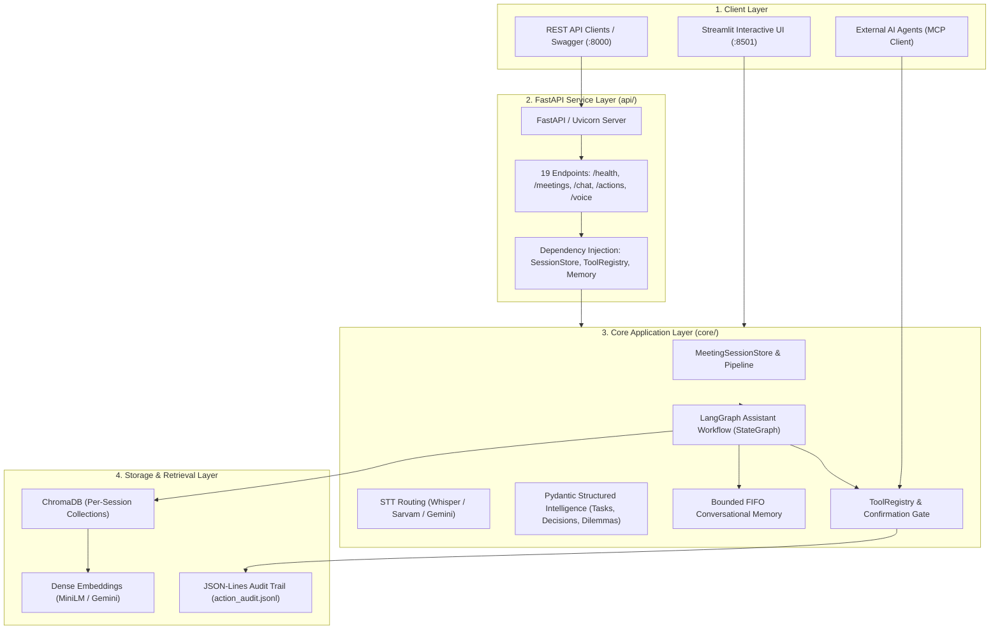

# Jitsly

### AI Meeting & Video Intelligence Assistant

Turn long-form meetings and videos into **searchable, evidence-grounded intelligence and controlled actions.**

[](https://www.python.org/)
[](https://fastapi.tiangolo.com/)
[](https://streamlit.io/)
[](https://langchain-ai.github.io/langgraph/)
[](https://www.langchain.com/)
[](https://www.trychroma.com/)
[](https://ai.google.dev/)
[](https://mistral.ai/)
[](https://github.com/openai/whisper)
[](https://modelcontextprotocol.io/)

---

## 📌 Product Overview

**Jitsly** is an evidence-grounded meeting intelligence system that transforms audio and video recordings into searchable transcripts, citation-backed answers, context-aware conversational follow-ups, structured meeting outcome registers, and confirmation-gated tool actions.

---

## 💡 Why Jitsly?

Naive LLM-based meeting assistants typically follow a fragile linear flow:

```text
Meeting Media ──► Speech-to-Text ──► Raw Dump to LLM ──► Unverified Summary
```

This pattern suffers from critical failure modes in technical and enterprise environments:
* **Hallucinated Decisions**: LLMs conflate proposed ideas with confirmed agreements.
* **Missing Context & Traceability**: Generated points lack timestamps, making manual verification tedious.
* **Stateless Amnesia**: Follow-up questions fail when pronouns (*"Who owns it?"*) are used.
* **Unsafe Automations**: AI agents blindly executing actions without human verification create accidental emails and rogue calendar invites.

Jitsly addresses these challenges with a rigorous, auditable architecture:

```text
Media Ingestion
      │
      ▼
Silence-Aware STT & Segmentation
      │
      ▼
ChromaDB Vector Retrieval
      │
      ▼
Evidence Grounding with [E1] Citations
      │
      ▼
Conversational Memory & Disambiguation
      │
      ▼
Structured Intelligence (Tasks, Decisions, Dilemmas)
      │
      ▼
Controlled Actions (Task, Calendar, Email)
      │
      ▼
Human-in-the-Loop Confirmation Gate
      │
      ▼
Action Execution & JSON-Lines Audit Trail
```

---

## ⚡ Key Capabilities

| Capability | Description |
|---|---|
| **FastAPI REST API Layer** | Production-oriented REST API service exposing 19 OpenAPI operations across `/health`, `/meetings`, `/chat`, `/actions`, and `/voice`. |
| **LangGraph Stateful Orchestration** | Explicit StateGraph managing query intent routing, entity disambiguation, evidence evaluation, and controlled tool execution. |
| **Multi-Provider AI Architecture** | Primary Google Gemini (configurable via `GEMINI_MODEL`, default: `gemini-1.5-flash`) with automatic Mistral fallback and optional Langfuse tracing. |
| **Multilingual STT Routing** | Local Whisper, Sarvam AI (Hindi/Hinglish), and Gemini transcription with silence-aware acoustic splitting. |
| **Grounded RAG** | Per-session ChromaDB collections with local `all-MiniLM-L6-v2` dense embeddings and optional Gemini embeddings. |
| **Evidence Provenance** | Every factual claim cites specific evidence blocks (`[E1]`) with start/end timestamps and source segment links. |
| **Conversational Memory** | Disambiguates pronouns and ellipsis follow-ups using a bounded FIFO rolling history ($\le 6$ turns). |
| **Meeting Intelligence Workspace** | Structured extraction into Pydantic models: Action Items with status lifecycle, Confirmed Decisions, and Open Dilemmas. |
| **Voice Interaction** | Speech-to-text audio query input via Whisper and natural speech synthesis output via `gTTS`. |
| **Controlled Tool Execution** | Converts meeting commitments into Tasks, Calendar events, and Email drafts with audit logging. |
| **Human-in-the-Loop Gate** | High-impact actions (`send_email`, `create_calendar_event`) require explicit user confirmation before execution. |
| **Model Context Protocol (MCP)** | Standardized stdio JSON-RPC 2.0 server allowing external AI agents to call Jitsly tools safely. |
| **Zero-Key Offline Demo Mode** | Instant exploration using a pre-indexed real-world engineering migration meeting without external API keys. |
| **Production Guardrails** | Deterministic upload size, audio duration, and transcript limits, accompanied by secret-scrubbing logs. |

---

## 🏛️ System Architecture



---

## 🔬 Technical Deep Dive

### 1. Media & Audio Layer (`utils/audio_processor.py`)
- Standardizes all media inputs to 16 kHz Mono 16-bit PCM WAV.
- Applies conservative peak volume normalization (-0.5 dBFS headroom) when dynamic range allows.
- Implements `find_silence_split`: searches within $\pm 5$ seconds of chunk boundaries for local RMS minima to prevent splitting audio mid-word.
- Guarantees immediate cleanup of temporary downloaded files and converted WAV slices via `cleanup_temp_files`.

### 2. Speech Layer (`core/transcription/transcriber.py`)
- **English**: Local `openai-whisper` running on CPU or CUDA (default model: `small`).
- **Hindi / Hinglish**: Sarvam AI REST API (`saaras:v2.5`), chunked into 25-second pieces to comply with API limits.
- **Multimodal Cloud**: Direct Gemini audio transcription via Google GenAI SDK when configured.
- Extracts start and end timestamps directly from STT segment payloads.

### 3. Retrieval & Embedding Layer (`core/retrieval/vector_store.py`)
- Chunks text using `RecursiveCharacterTextSplitter(chunk_size=600, chunk_overlap=100)`.
- Generates dense vectors using local `sentence-transformers/all-MiniLM-L6-v2` (384-d, CPU-optimized) or optional Gemini `models/text-embedding-004`.
- Stores vectors in session-isolated ChromaDB collections (`meeting_<session_id>`), guaranteeing zero data bleed between meetings.
- Enriches every chunk with scalar metadata: `start_seconds`, `end_seconds`, `time_range`, and `segment_ids`.

### 4. Stateful Orchestration & LLM Layer (`core/workflow.py`, `core/llm_provider.py`)
- **LangGraph StateGraph**: Orchestrates conversation turns through explicit graph nodes (`node_understand_query`, `node_retrieve`, `node_generate`, `node_execute_actions`).
- **Multi-Provider LLM**: Primary engine Google Gemini (configurable via `GEMINI_MODEL`, default: `gemini-1.5-flash`) with automated fallback to Mistral (`mistral-small-latest`) upon quota exhaustion or transient network failure.
- **Evidence Provenance & Grounding**: Retrieved context is delimited with XML markers. Explicit citations (`[E1]`, `[E2]`) are required. If information is unmentioned, returns deterministic refusal:
  > *"I could not find this information in the meeting transcript."*
- **Observability**: Optional lightweight tracing with Langfuse (`core/observability.py`).

### 5. Memory Layer (`core/memory/`)
- In-session `SessionConversationMemory` retains conversation turns within a bounded FIFO rolling window ($\le 6$ turns).
- Implements `resolve_conversational_query`: uses recent conversation turns to disambiguate pronouns and ellipsis references prior to retrieval.
- Automatically clears memory upon meeting session ID changes to eliminate cross-session memory bleed.

### 6. Meeting Intelligence Layer (`core/intelligence/extractor.py`)
- Uses Pydantic v2 schemas (`ActionItem`, `DecisionItem`, `OpenQuestionItem`) for structured extraction.
- **Decision vs. Proposal Discrimination**: Distinguishes between confirmed team decisions and rejected/tabled discussions.
- **Normalization of Missing Metadata**: Explicitly sets unstated deadlines or unassigned owners to `None`, displayed as `"Not specified"`.

### 7. Controlled Action Layer (`core/actions/`)
- **Adapters**:
  - `TaskTool`: In-memory task management linking tasks directly to transcript evidence.
  - `CalendarTool`: Validates ISO-8601 / datetime strings and formats meeting invitations.
  - `EmailTool`: Prepares structured email drafts and stages messages for delivery.
- **Human-in-the-Loop Confirmation Gate (`ConfirmationManager`)**:
  - Distinguishes between safe actions (`create_task`, `draft_email`) and high-impact actions (`send_email`, `create_calendar_event`).
  - High-impact actions are held in a pending state with risk ratings and preview summaries until explicit user approval via `/confirm`.
  - Pending actions expire after a configurable TTL (default: 300 seconds).
- **Audit Logging**: Appends action proposals, confirmations, cancellations, and executions to `action_audit.jsonl`.
- *Note*: External provider integrations currently utilize local, deterministic in-memory adapters; production OAuth 2.0 connections (Google Workspace, Microsoft 365) are designed as future extension modules.

### 8. Model Context Protocol (MCP) Layer (`mcp_server/server.py`)
- Exposes Jitsly's tool registry over a standard stdio JSON-RPC 2.0 interface.
- Supports `initialize`, `ping`, `tools/list`, and `tools/call`.
- Allows external MCP-compatible agents (e.g., Claude Desktop, Cursor) to discover and execute meeting tools with full schema validation.

### 9. FastAPI REST API Layer (`api/main.py`)
- Production-oriented REST API layer exposing 19 verified OpenAPI operations across 5 modular routers in `api/routes/`:
  - **System**: `GET /`, `GET /api/v1/health`
  - **Meetings**: `POST /api/v1/meetings/youtube`, `POST /api/v1/meetings/upload`, `POST /api/v1/meetings/demo`, `POST /api/v1/meetings/{session_id}/process`, `GET /api/v1/meetings/{session_id}`, `GET /api/v1/meetings/{session_id}/summary`, `GET /api/v1/meetings/{session_id}/actions`, `GET /api/v1/meetings/{session_id}/decisions`, `GET /api/v1/meetings/{session_id}/open-questions`
  - **Chat**: `POST /api/v1/chat` (delegates to LangGraph StateGraph)
  - **Actions**: `GET /api/v1/actions/tools`, `POST /api/v1/actions`, `GET /api/v1/actions/pending`, `POST /api/v1/actions/{action_id}/confirm`, `POST /api/v1/actions/{action_id}/reject`
  - **Voice**: `POST /api/v1/voice/transcribe`, `POST /api/v1/voice/synthesize`
- Thin HTTP controllers in `api/routes/` delegating directly to `core/` services without logic duplication.
- Global exception handling returning structured JSON envelopes (HTTP 400, 404, 422, 500) without leaking stack traces or secrets.
- Interactive OpenAPI documentation available at `/docs` (Swagger UI) and `/redoc` (ReDoc).

---

## 🔎 Evidence & Provenance in Practice

Unlike traditional meeting summarizers that output unverified assertions, Jitsly attributes every claim to exact transcript time windows:

```text
Question: What database did the team choose?

Answer: The team decided to migrate the primary backend database from MySQL to 
        PostgreSQL following benchmarking showing 40% write throughput gains [E1].

Cited Evidence:
[E1] 00:00:55 – 00:01:40 (Chunk #0)
"Sarah: Let's start with our primary database. After extensive benchmarking comparing 
MySQL 8 and PostgreSQL 16 under high concurrency, our team decided to migrate our 
primary transactional database from MySQL to PostgreSQL."
```

---

## 🗣️ Conversational Memory Walkthrough

```text
User:       Who is responsible for the database migration?
Assistant:  Rahul is responsible for preparing and distributing the PostgreSQL 
            migration plan by Friday at 5 PM [E1].

User:       When is it due?
Assistant:  The migration plan is due by Friday at 5 PM [E1].
            (Resolved Query: "When is the PostgreSQL migration plan due?")

User:       What is the budget for it?
Assistant:  I could not find this information in the meeting transcript.
```

---

## 📋 Structured Intelligence Output

```text
Action Items Register
├── Task: Prepare and distribute complete PostgreSQL migration plan
│   ├── Owner: Rahul
│   ├── Deadline: Friday at 5 PM
│   ├── Status: Open (User toggleable: Open | In Progress | Done)
│   └── Evidence: "Rahul: Yes, I will prepare and distribute the complete..." (00:03:25 - 00:04:00)
└── Task: Update database indexing scripts for new schema changes
    ├── Owner: Not specified (Explicitly unassigned in transcript)
    ├── Deadline: Not specified
    └── Status: Open

Key Decisions Register
├── Decision: Migrate primary transactional database from MySQL to PostgreSQL 16
│   └── Evidence: Benchmarking demonstrated 40% write throughput advantage (00:00:55 - 00:01:40)
└── Rejected Proposal: External contractor firm for cutover
    └── Evidence: Rejected because in-house team requires deep familiarity with failover playbooks (00:02:45 - 00:03:25)

Open Dilemmas Register
└── Dilemma: Primary AWS deployment region selection
    └── Context: Compliance team has not finalized EU data residency requirements (00:05:10 - 00:05:45)
```

---

## 🛡️ Safety & Production Guardrails

- **Storage Garbage Collection**: `cleanup_old_temp_files` automatically prunes intermediate audio chunks older than 2 hours to avoid disk exhaustion.
- **Secret Scrubbing**: `SecretScrubbingFilter` intercepts logs to redact API keys and credential strings before stdout emission.
- **Resource Thresholds**:
  - Maximum upload size: $100\text{ MB}$ (`MAX_UPLOAD_SIZE_MB`)
  - Maximum audio duration: $90\text{ minutes}$ (`MAX_AUDIO_DURATION_MINUTES`)
  - Maximum transcript size: $250{,}000\text{ characters}$ (`MAX_TRANSCRIPT_CHARS`)
- **System Health Diagnostics**: Built-in `get_system_health()` checks Python environment, FFmpeg executable resolution, PyTorch/CUDA availability, API credentials, and directory write permissions.

---

## 📊 Evaluation & Empirical Benchmarks

The Phase 7 evaluation harness (`tests/evaluation/`) was benchmarked across a multi-speaker dataset comprising 3 fixtures (~3,200 words, 42 dialogue segments, 22 evaluation cases).

> **Important Note**: The current evaluation suite verifies the configured Recall@4 and citation-validity cases on the project's deterministic evaluation dataset and should not be construed as unconstrained production performance.

| Evaluation Metric | Observed Result | Scope / Notes |
|---|---|---|
| **Retrieval Recall@4** | **100.0%** (18/18) | Captures all necessary evidence context chunks for answerable queries. |
| **Retrieval Recall@2** | **94.4%** (17/18) | Reduced due to cross-topic queries requiring $>2$ chunks. |
| **Citation Validity** | **100.0%** (14/14) | Citations map to valid time ranges within the active session. |
| **Unsupported Question Refusal**| **100.0%** (4/4) | Returns clean refusal without fabricating missing information. |
| **False-Premise Resistance** | **100.0%** (4/4) | Rejects incorrect assumptions (e.g., fake contractor hire). |
| **Action Extraction Precision** | **100.0%** (8/8) | Correctly extracts task descriptions, owners, and deadlines. |
| **Owner Normalization Accuracy** | **100.0%** | Unstated owners normalized strictly to `None`. |
| **Cross-Session Data Bleed** | **0 Leaks** | Verified total vector store and memory isolation across meetings. |

---

## 🧪 Automated Test Verification

Jitsly maintains a comprehensive multi-tiered testing suite covering unit, integration, RAG, and REST API layers:

```bash
# 1. Run FastAPI Backend Endpoint Suite (20 Tests)
pytest tests/api -q
# or: python -m unittest discover -s tests/api -p "test_*.py"

# 2. Run LangGraph Stateful Assistant Workflow Suite (7 Tests)
python -m unittest tests/test_workflow.py

# 3. Run Production Smoke Tests (< 25s, 9 Tests)
python tests/test_smoke.py

# 4. Run MCP & Controlled External Action Tests (27 Tests)
python tests/phase8/test_phase8_actions.py

# 5. Run Deterministic Evaluation & Retrieval Harness (15 Test Milestones)
python tests/evaluation/test_phase7_evaluation.py

# 6. Run Complete Pytest Suite (36 Tests)
pytest tests/ -q
```

### Test Suite Execution Summary
* **API tests**: 20 passed (in 25.7s)
* **Workflow tests**: 7 passed (in 0.07s)
* **Smoke tests**: 9 passed (in 20.1s)
* **Phase 8 tests**: 27 passed (23 tool tests + 4 regression checks)
* **Evaluation tests**: 15 passed (14 benchmarks + 1 regression check)
* **Full pytest suite**: 36 passed (with 30 subtests reported separately)
* **Overall Status**: **All regression, workflow, and API suites pass with zero failures.**

---

## 📁 Repository Structure

```text
.
├── app.py                      # Production Streamlit UI & workspace orchestration
├── main.py                     # CLI pipeline entry point
├── Dockerfile                  # Containerized deployment definition
├── packages.txt                # System package dependency (ffmpeg)
├── requirements.txt            # Python dependencies (FastAPI, Uvicorn, LangGraph, Streamlit)
├── .env.example                # Documented configuration template
├── .gitignore                  # Exclusion of secrets, media, vector DBs, and logs
├── api/                        # FastAPI REST API Backend
│   ├── main.py                 # FastAPI application entrypoint, CORS, exception handlers
│   ├── dependencies.py         # Singleton dependency injection providers
│   ├── schemas/                # Pydantic v2 request/response contracts
│   │   ├── common.py           # HealthResponse, ErrorResponse
│   │   ├── chat.py             # ChatRequest, ChatResponse, CitationItem, EvidenceItem
│   │   ├── meeting.py          # Ingest, Process, Detail responses
│   │   ├── intelligence.py     # Summary, ActionItems, Decisions, OpenQuestions
│   │   └── actions.py          # Execution, Confirmation, Staging schemas
│   └── routes/                 # Thin HTTP controller routers
│       ├── health.py           # GET /api/v1/health
│       ├── meetings.py         # Ingestion, pipeline processing, intelligence
│       ├── chat.py             # POST /api/v1/chat (delegates to LangGraph)
│       ├── actions.py          # GET/POST /api/v1/actions (execution, confirmation)
│       └── voice.py            # POST /api/v1/voice (STT & TTS)
├── core/
│   ├── config.py               # Central config, limits, health check, and storage cleanup
│   ├── demo.py                 # Offline demo fixture loader & CPU vector indexer
│   ├── logger.py               # Central logger with secret-scrubbing filter
│   ├── llm_provider.py         # Gemini 1.5 Flash primary with Mistral fallback
│   ├── observability.py        # Langfuse tracing & callback handler integration
│   ├── session_store.py        # Thread-safe in-memory MeetingSessionStore & pipeline
│   ├── workflow.py             # LangGraph StateGraph assistant workflow orchestration
│   ├── ingestion/              # Audio/video input processing, normalization & chunking
│   ├── transcription/          # Whisper, Sarvam, and Gemini STT engines
│   │   └── transcriber.py      # Transcriber implementation & language routing
│   ├── intelligence/           # Meeting intelligence workspace & summarization
│   │   ├── extractor.py        # Pydantic structured intelligence models
│   │   └── summarizer.py       # Executive summary & title generation
│   ├── retrieval/              # ChromaDB vector storage & grounded RAG
│   │   ├── vector_store.py     # ChromaDB session-isolated vector database
│   │   ├── rag_engine.py       # Grounded RAG chain & evidence citation logic
│   │   └── provenance.py       # Evidence models, timestamp parsing & audit
│   ├── memory/                 # Conversational multi-turn memory
│   │   └── memory.py           # FIFO memory bounding & query resolution
│   ├── voice/                  # Speech-to-text query input & TTS playback
│   │   └── voice.py            # Voice processing & audio answer synthesis
│   └── actions/                # Controlled external actions & MCP tools
│       ├── models.py           # Tool definitions, pending actions & execution results
│       ├── task_tools.py       # Task creation and listing adapter
│       ├── calendar_tools.py   # Calendar event scheduling adapter
│       ├── email_tools.py      # Email draft and gated dispatch adapter
│       ├── confirmation.py     # TTL-based human-in-the-loop confirmation gate
│       ├── tool_registry.py    # Tool registry with risk-level classification
│       └── action_resolver.py  # Maps extracted action items to ready tool calls
├── mcp_server/
│   └── server.py               # Stdio JSON-RPC 2.0 Model Context Protocol server
├── reports/                    # Historical engineering reports (Phases 1–9 + Modernization)
│   └── README.md               # Timeline and index of all phase reports
├── tests/
│   ├── api/                    # FastAPI endpoint test suite (20 tests)
│   ├── test_workflow.py        # LangGraph stateful workflow test suite (7 tests)
│   ├── test_smoke.py           # Production readiness smoke suite (9 tests)
│   ├── phase8/                 # MCP and action tool test suite (27 tests)
│   └── evaluation/             # Retrieval evaluation harness and meeting fixtures (15 tests)
└── utils/
    └── audio_processor.py      # yt-dlp, FFmpeg audio conversion, and silence-split chunker
```

---

## 🚀 Installation & Local Setup

### 1. Prerequisites
- **Python**: Version `3.10` or `3.11`
- **FFmpeg**: Must be installed and available on system `PATH`
  - *Windows*: `winget install Gyan.FFmpeg`
  - *macOS*: `brew install ffmpeg`
  - *Linux*: `sudo apt-get update && sudo apt-get install -y ffmpeg`

### 2. Clone & Setup Environment
```bash
git clone https://github.com/Tanishka798/Gistly-AI-Meeting-Video-Intelligence-Assistant-.git
cd Gistly-AI-Meeting-Video-Intelligence-Assistant-

# Create virtual environment
python -m venv venv

# Activate virtual environment
# Windows (PowerShell):
.\venv\Scripts\Activate.ps1
# macOS/Linux:
source venv/bin/activate

# Install dependencies
pip install --upgrade pip
pip install -r requirements.txt
```

### 3. Configure Credentials
Copy the `.env.example` template:
```bash
cp .env.example .env
```
Configure your environment variables:
```ini
# Mistral AI API Key (Required for live cloud summarization and RAG chat)
MISTRAL_API_KEY=your_mistral_api_key_here

# Sarvam AI API Key (Optional: required only for Hindi/Hinglish STT)
SARVAM_API_KEY=your_sarvam_api_key_here

# Local Whisper STT model weight (tiny, base, small, medium)
WHISPER_MODEL=small

# Resource Guardrails
MAX_UPLOAD_SIZE_MB=100
MAX_AUDIO_DURATION_MINUTES=90
MAX_TRANSCRIPT_CHARS=250000
```
*(Note: If `MISTRAL_API_KEY` is omitted, Jitsly automatically defaults to Demo Mode with CPU vector retrieval.)*

---

## 💻 Running the Application

### Option 1: Streamlit Frontend UI
Launch the interactive Streamlit application:
```bash
streamlit run app.py
```
Open your browser at `http://localhost:8501`.

### Option 2: FastAPI Production API Server
Launch the REST API backend:
```bash
uvicorn api.main:app --host 0.0.0.0 --port 8000 --reload
```
- Interactive Swagger UI: `http://localhost:8000/docs`
- Interactive ReDoc: `http://localhost:8000/redoc`
- OpenAPI Specification: `http://localhost:8000/openapi.json`
- Health Endpoint: `http://localhost:8000/api/v1/health`

### Recommended Demo Walkthrough (Zero API Keys Required)
1. **Launch App**: Open `http://localhost:8501`.
2. **Load Demo Meeting**: Click the prominent **"🎯 Load Demo Meeting"** button in the sidebar.
3. **Inspect Workspace**: Review the pre-analyzed executive summary, KPI metrics, action items register, confirmed decisions, and open dilemmas.
4. **Ask a Question**: In the chat panel, ask: *"Which database did the team choose to migrate to?"*
5. **Inspect Evidence**: Observe the citation badge `[E1]` and review the exact timestamp range and verbatim quote.
6. **Try a Follow-Up**: Ask: *"Who is responsible for it?"* — observe conversational memory resolve the entity to the PostgreSQL migration plan.
7. **Propose an Action**: Click **"⚡ Create Task"** next to an action item or type *"Create a task for Rahul"* in the chat.
8. **Test Confirmation**: For high-risk actions (e.g. Schedule Event or Send Email), observe the Confirmation Gate stage the action with a risk warning requiring human approval.

---

## 🐳 Docker Deployment

The application includes a verified, lightweight Docker configuration:

```bash
# Build Docker image
docker build -t jitsly:latest .

# Run container exposing port 8501
docker run -p 8501:8501 --env-file .env jitsly:latest
```

### Cloud Platform Readiness
- **Streamlit Community Cloud**: Ready for immediate deployment. `packages.txt` automatically provisions `ffmpeg`.
- **Hugging Face Spaces**: Compatible with Streamlit Docker space runtimes.
- *Note*: Deployment configuration is verified; public demonstration hosting depends on user-configured cloud deployments.

---

## ⚙️ Configuration Reference

| Environment Variable | Category | Default | Purpose |
|---|---|---|---|
| `GEMINI_API_KEY` | Cloud Intelligence | `None` | Primary Gemini API key for grounded Q&A, summarization, and extraction. |
| `GEMINI_MODEL` | Cloud Intelligence | `"gemini-1.5-flash"` | Gemini model identifier for core intelligence and chat. |
| `MISTRAL_API_KEY` | Cloud Intelligence | `None` | Fallback LLM API key for summarization, extraction, and RAG Q&A. |
| `LLM_PROVIDER` | Cloud Intelligence | `"auto"` | LLM provider selection: `"auto"`, `"gemini"`, or `"mistral"`. |
| `EMBEDDING_PROVIDER` | Vector Embeddings | `"local"` | Embeddings provider: `"local"` (`all-MiniLM-L6-v2`) or `"gemini"` (`text-embedding-004`). |
| `SARVAM_API_KEY` | Cloud STT | `None` | API key for Sarvam AI Hindi/Hinglish speech-to-text translation. |
| `WHISPER_MODEL` | Local STT | `"small"` | Whisper model size (`tiny`, `base`, `small`, `medium`). |
| `SARVAM_STT_MODEL` | Cloud STT | `"saaras:v2.5"` | Sarvam translation model identifier. |
| `API_HOST` | FastAPI Service | `"0.0.0.0"` | Host IP binding for FastAPI REST backend. |
| `API_PORT` | FastAPI Service | `8000` | Port for FastAPI REST backend. |
| `CORS_ORIGINS` | FastAPI Service | `http://localhost:8501,...` | Comma-separated list of allowed CORS origins. |
| `LANGFUSE_ENABLED` | Observability | `false` | Enables lightweight Langfuse tracing for RAG and LLM calls. |
| `MAX_UPLOAD_SIZE_MB` | Guardrail | `100` | Maximum file upload size in megabytes. |
| `MAX_AUDIO_DURATION_MINUTES` | Guardrail | `90.0` | Maximum audio duration in minutes. |
| `MAX_TRANSCRIPT_CHARS` | Guardrail | `250000` | Maximum transcript characters processed before extraction truncation. |
| `DOWNLOAD_DIR` | Storage | `"downloades"` | Directory for temporary audio conversion and chunking. |
| `CHROMA_PERSIST_DIRECTORY` | Storage | `"vector_db"` | Storage directory for ChromaDB vector embeddings. |
| `AUDIT_LOG_PATH` | Audit | `"action_audit.jsonl"` | JSON-Lines append-only action audit trail. |
| `DEMO_MODE` | Application Mode | `false` | When true, boots directly into the offline demo state. |

---

## 🧠 Architectural Decisions & Rationale

* **Why ChromaDB?** Local, embedded vector persistence without external cluster dependencies, enabling reproducible offline runs and fast session collection lifecycles.
* **Why `all-MiniLM-L6-v2`?** Compact 384-dimensional embeddings that run efficiently on commodity CPUs without requiring GPU acceleration.
* **Why Per-Session Collections?** Embedding collections are keyed to `meeting_<session_id>`, providing complete mathematical separation and preventing multi-meeting data leakage.
* **Why Rule-Based Query Disambiguation for Memory?** Direct conversational resolution provides predictable, low-latency follow-up routing without incurring additional LLM latency or non-deterministic rewrites.
* **Why Human-in-the-Loop Confirmation Gates?** Autonomous agents executing unreviewed actions cause real-world errors. Staging high-impact operations ensures human oversight.
* **Why the Model Context Protocol (MCP)?** Standardizing tools on MCP JSON-RPC 2.0 decouples the execution engine from the chat UI, allowing external agent systems to call Jitsly capabilities cleanly.
* **Why Streamlit?** Provides a responsive, reactive interface that enables fast end-to-end demonstrations of complex multimodal workflows in a single codebase.
* **Why LangGraph?** Replaces implicit linear chains with an explicit `StateGraph` that clearly isolates query understanding, retrieval, evidence evaluation, answer generation, and tool actions into auditable nodes with deterministic transitions.
* **Why FastAPI?** Decouples backend core logic from UI rendering, exposing 19 standard REST endpoints for external frontend clients, microservices, and API testing while keeping Streamlit as the interactive desktop/browser interface.

---

## ⚠️ Known Limitations

1. **In-Memory Session State**: Session state and in-memory action registries are process-local; multi-worker horizontal scaling requires an external cache adapter (e.g. Redis).
2. **Synchronous STT Execution**: Large audio recordings ($>45\text{ minutes}$) run synchronously during processing.
3. **Local Vector Database Persistence**: ChromaDB runs locally on SQLite; managed cloud vector stores are suited for high-concurrency multi-tenant scenarios.
4. **Mock External Action Adapters**: The Task, Calendar, and Email adapters execute locally with schema validation and audit logging; live OAuth 2.0 integrations (e.g. Google Workspace) represent a future extension.
5. **CPU Whisper Performance**: Whisper transcription speed depends on host CPU threads when running without CUDA.

---

## 🔮 Future Roadmap

* **Managed Vector Storage**: Connect managed vector databases (e.g. Qdrant, Pinecone) for multi-tenant deployments.
* **Production OAuth 2.0 Providers**: Direct synchronization with Google Calendar, Jira, and Microsoft 365.
* **Asynchronous Background Processing**: Task queues (e.g. ARQ / Celery) for non-blocking transcription of multi-hour recordings.
* **Speaker Diarization**: Machine-learning diarization (e.g. PyAnnote) for automated multi-speaker identification.

---

## 📚 Engineering Documentation

The complete historical evolution of Jitsly across all engineering phases and subsequent modernization is preserved in [`reports/`](./reports/):

| Phase | Focus Area | Report Link |
|---|---|---|
| **Phase 1** | Reliability & System Diagnosis (Historical) | [`reports/phase-01-reliability/`](./reports/phase-01-reliability/PHASE1_RELIABILITY_REPORT.md) |
| **Phase 2** | Audio Ingestion, STT & RAG Quality | [`reports/phase-02-audio-rag/`](./reports/phase-02-audio-rag/PHASE2_AUDIO_RAG_SYNTHESIS.md) |
| **Phase 3** | Evidence Provenance & Source Attribution | [`reports/phase-03-provenance/`](./reports/phase-03-provenance/PHASE3_PROVENANCE_REPORT.md) |
| **Phase 4** | Context-Aware Conversational Memory | [`reports/phase-04-memory/`](./reports/phase-04-memory/PHASE4_CONVERSATIONAL_MEMORY_REPORT.md) |
| **Phase 5** | Voice Interaction & Multimodal Assistant | [`reports/phase-05-voice/`](./reports/phase-05-voice/PHASE5_VOICE_REPORT.md) |
| **Phase 6** | Meeting Intelligence Workspace | [`reports/phase-06-intelligence/`](./reports/phase-06-intelligence/PHASE6_MEETING_INTELLIGENCE_REPORT.md) |
| **Phase 7** | Evaluation & Retrieval Intelligence | [`reports/phase-07-evaluation/`](./reports/phase-07-evaluation/PHASE7_EVALUATION_REPORT.md) |
| **Phase 8** | MCP & Controlled External Actions | [`reports/phase-08-mcp-actions/`](./reports/phase-08-mcp-actions/PHASE8_MCP_ACTIONS_REPORT.md) |
| **Phase 9** | Productionization & Deployment | [`reports/phase-09-production/`](./reports/phase-09-production/PHASE9_PRODUCTION_READINESS_REPORT.md) |
| **Modernization** | FastAPI REST Layer & LangGraph Architecture | [`reports/README.md`](./reports/README.md#modern-architecture--fastapi-layer) |
