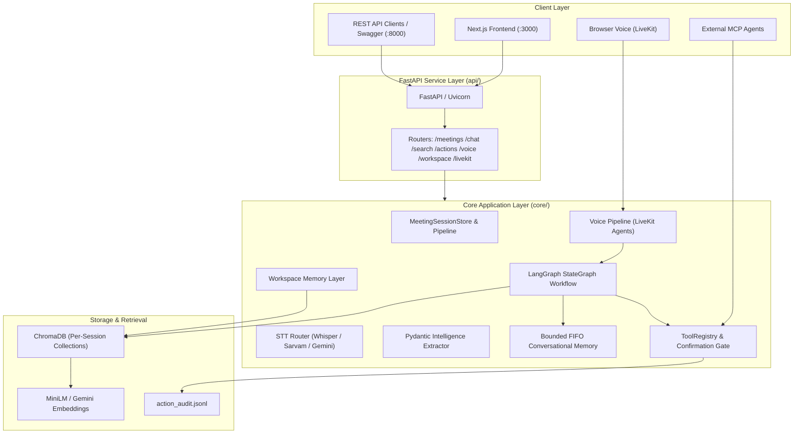

# RecallAI

### Meeting & Video Intelligence Assistant

Transform long-form meetings and video recordings into **searchable, evidence-grounded intelligence and confirmation-gated actions.**

[](https://www.python.org/)
[](https://fastapi.tiangolo.com/)
[](https://nextjs.org/)
[](https://langchain-ai.github.io/langgraph/)
[](https://www.trychroma.com/)
[](https://ai.google.dev/)
[](https://livekit.io/)
[](https://modelcontextprotocol.io/)

---

## Overview

RecallAI is a multimodal conversation intelligence platform. It ingests meetings from YouTube URLs or uploaded audio/video files, runs silence-aware transcription, indexes segments into a per-session vector store, and makes that content available through a grounded AI assistant, structured meeting intelligence, voice interaction, and confirmation-gated tool actions.

The architecture follows a clear separation: a **Next.js + TypeScript frontend** talks to a **FastAPI backend** that delegates to a **Python AI core** built on LangChain, LangGraph, and ChromaDB.

---

## Why RecallAI?

Naive LLM meeting assistants share a common failure pattern:

```text
Meeting Media → Speech-to-Text → Raw dump to LLM → Unverified summary
```

This produces hallucinated decisions, unattributed claims, stateless conversations that break on follow-ups, and agents that execute actions without human review.

RecallAI addresses each failure mode:

```text
Media Ingestion
      │
      ▼
Silence-Aware STT & Segmentation
      │
      ▼
ChromaDB Vector Retrieval (per-session isolation)
      │
      ▼
Evidence Grounding with [E1] Citations
      │
      ▼
Conversational Memory & Query Disambiguation
      │
      ▼
Structured Intelligence (Tasks, Decisions, Dilemmas)
      │
      ▼
Controlled Actions with Human-in-the-Loop Gate
      │
      ▼
Action Execution & JSON-Lines Audit Trail
```

---

## Core Capabilities

| Capability | Description |
|---|---|
| **FastAPI REST API** | Production REST API exposing endpoints across `/health`, `/meetings`, `/chat`, `/search`, `/actions`, `/voice`, and `/workspace`. |
| **LangGraph Orchestration** | Explicit `StateGraph` routing query intent, entity disambiguation, evidence evaluation, and tool execution across auditable nodes. |
| **Grounded RAG** | Per-session ChromaDB collections with local `all-MiniLM-L6-v2` embeddings. Every answer cites evidence blocks with timestamps. |
| **Conversational Memory** | Disambiguates pronouns and ellipsis follow-ups using a bounded FIFO rolling window (≤ 6 turns). |
| **Workspace Intelligence** | Cross-meeting global search and RAG, surfacing provenance from multiple sessions simultaneously. |
| **Meeting Intelligence** | Structured extraction of Action Items, Confirmed Decisions, and Open Dilemmas via Pydantic v2 models. |
| **Voice Interaction (LiveKit)** | Real-time voice sessions via LiveKit Agents: Silero VAD → STT → RecallAI pipeline → TTS. Reuses existing intelligence layer. |
| **Human-in-the-Loop Gate** | High-impact actions (`send_email`, `create_calendar_event`) are staged as pending, requiring explicit user confirmation before execution. |
| **MCP Server** | Stdio JSON-RPC 2.0 server exposing RecallAI tools to external MCP-compatible agents (e.g. Claude Desktop, Cursor). |
| **Multi-Provider LLM** | Primary Google Gemini (`gemini-1.5-flash`), automatic fallback to Mistral. |
| **Multilingual STT** | Local Whisper (English), Sarvam AI (Hindi/Hinglish), optional Gemini multimodal transcription. |
| **Demo Mode** | Zero-API-key offline demo using a pre-indexed engineering migration meeting. |

---

## Architecture



---

## RAG Pipeline

- Text is chunked with `RecursiveCharacterTextSplitter(chunk_size=600, overlap=100)`.
- Dense vectors are generated locally with `sentence-transformers/all-MiniLM-L6-v2` (384-d, CPU-optimized), or via Gemini `models/text-embedding-004`.
- Chunks are stored in session-isolated ChromaDB collections (`meeting_<session_id>`), with scalar metadata: `start_seconds`, `end_seconds`, `time_range`, `segment_ids`.
- Retrieved context is wrapped in XML delimiters. The LLM is required to cite `[E1]`, `[E2]` references. If information is absent, it returns a deterministic refusal.

---

## LangGraph Workflow

`core/workflow.py` implements an explicit `StateGraph` with four nodes:

1. **`node_understand_query`** — Classifies intent (question, clarify, action, chit-chat) and resolves conversational references using session memory.
2. **`node_retrieve`** — Performs vector similarity search and filters results by relevance score.
3. **`node_generate`** — Calls the LLM with grounded context, generates citations.
4. **`node_execute_actions`** — Routes tool calls through the `ToolRegistry` and `ConfirmationManager`.

---

## Workspace Intelligence

`core/retrieval/workspace_rag.py` and `core/memory/workspace_memory.py` provide cross-meeting capabilities:

- `GET /api/v1/workspace/search` — full-text and semantic search across all ingested sessions.
- `POST /api/v1/workspace/chat` (SSE) — workspace-scoped RAG assistant with multi-meeting provenance.
- Workspace memory maintains a session-isolated conversation history separate from per-meeting chat.

---

## MCP Server

`mcp_server/server.py` exposes RecallAI tools over stdio JSON-RPC 2.0:

- Supports `initialize`, `ping`, `tools/list`, and `tools/call`.
- Server name: `recallai-meeting-assistant`.
- Allows external agents to discover and call meeting tools with full schema validation.

---

## Voice Interaction (LiveKit Agents)

`core/voice/pipeline.py` implements `RecallAIPipelineAdapter(llm.LLM)` — a LiveKit Agents v1 LLM adapter that bridges the voice session to RecallAI's existing intelligence pipeline.

**Pipeline flow:**
```
Browser Microphone
      ↓ WebRTC
LiveKit Room
      ↓
Silero VAD (turn detection)
      ↓
STT (Deepgram cloud or local Whisper fallback)
      ↓
RecallAIPipelineAdapter.chat()
      ↓ calls
run_assistant_workflow() or run_workspace_assistant()
      ↓
prepare_text_for_speech() (strips citations for audio)
      ↓
TTS (OpenAI TTS or gTTS fallback)
      ↓
LiveKit Audio
```

The voice layer **reuses the same LangGraph workflow** as text chat. It does not duplicate the intelligence pipeline.

---

## Security & Guardrails

- **File extension validation** on all uploads (`validate_media_file_extension`).
- **Upload size limit**: configurable via `MAX_UPLOAD_SIZE_MB` (default: 100 MB).
- **Audio duration limit**: configurable via `MAX_AUDIO_DURATION_MINUTES` (default: 90 min).
- **Transcript length limit**: `MAX_TRANSCRIPT_CHARS` (default: 250,000 chars).
- **Secret scrubbing**: `SecretScrubbingFilter` redacts API keys from log output before any handler.
- **CORS hardening**: wildcard `*` disables `allow_credentials` automatically.
- **Human-in-the-loop gate**: high-impact actions staged for confirmation with TTL expiry (default: 300s).
- **Audit trail**: all action proposals, confirmations, and executions appended to `action_audit.jsonl`.
- **Temporary file cleanup**: `cleanup_old_temp_files` prunes audio chunks older than 2 hours.

---

## Tech Stack

| Layer | Technology |
|---|---|
| Frontend | Next.js 14, React, TypeScript, Tailwind CSS |
| Backend API | FastAPI, Uvicorn, Pydantic v2 |
| AI Orchestration | LangGraph, LangChain |
| LLM | Google Gemini (primary), Mistral (fallback) |
| Embeddings | sentence-transformers `all-MiniLM-L6-v2` (local), Gemini `text-embedding-004` (optional) |
| Vector Store | ChromaDB (local embedded) |
| STT | OpenAI Whisper (local), Sarvam AI (Hindi/Hinglish), Gemini (multimodal) |
| TTS | gTTS (local fallback), OpenAI TTS (optional) |
| Voice | LiveKit Agents v1, Silero VAD, Deepgram STT (optional) |
| Observability | Langfuse (optional) |
| Containerization | Docker, Docker Compose |
| Testing | pytest, unittest |

---

## Project Structure

```text
.
├── api/                        # FastAPI REST API backend
│   ├── main.py                 # Application entry point, CORS, exception handlers
│   ├── dependencies.py         # Singleton dependency injection providers
│   ├── schemas/                # Pydantic v2 request/response contracts
│   │   ├── common.py           # HealthResponse, ErrorResponse
│   │   ├── chat.py             # ChatRequest, ChatResponse, CitationItem
│   │   ├── meeting.py          # Ingest, Process, Detail responses
│   │   ├── intelligence.py     # Summary, ActionItems, Decisions, OpenQuestions
│   │   ├── workspace.py        # WorkspaceSearch, WorkspaceChat schemas
│   │   ├── search.py           # Cross-meeting search schemas
│   │   └── actions.py          # Execution, Confirmation, Staging schemas
│   └── routes/                 # Thin HTTP controller routers
│       ├── health.py           # GET /api/v1/health
│       ├── meetings.py         # Meeting ingestion and processing
│       ├── chat.py             # POST /api/v1/chat (SSE streaming)
│       ├── search.py           # GET /api/v1/search
│       ├── workspace.py        # Workspace intelligence and chat
│       ├── actions.py          # Action execution and confirmation
│       ├── voice.py            # POST /api/v1/voice (STT & TTS)
│       └── livekit.py          # LiveKit token & status endpoints
├── core/                       # Python AI core
│   ├── config.py               # Central config, limits, health diagnostics
│   ├── demo.py                 # Offline demo fixture loader
│   ├── logger.py               # Structured logger with secret-scrubbing filter
│   ├── llm_provider.py         # Gemini / Mistral LLM abstraction
│   ├── observability.py        # Langfuse tracing integration
│   ├── session_store.py        # Thread-safe in-memory MeetingSessionStore
│   ├── workflow.py             # LangGraph StateGraph assistant workflow
│   ├── ingestion/              # Audio/video normalization and chunking
│   ├── transcription/          # Whisper, Sarvam, and Gemini STT engines
│   ├── intelligence/           # Pydantic structured intelligence extraction
│   ├── retrieval/              # ChromaDB RAG, workspace RAG, provenance
│   ├── memory/                 # Per-session and workspace conversation memory
│   ├── voice/                  # LiveKit Agents pipeline adapter and TTS
│   └── actions/                # ToolRegistry, confirmation gate, action adapters
├── frontend/                   # Next.js 14 + TypeScript frontend
│   └── src/
│       ├── app/                # Next.js App Router pages
│       ├── components/         # React components (features/, ui/, layouts/)
│       ├── lib/                # API client, utilities
│       └── types/              # TypeScript type definitions
├── mcp_server/
│   └── server.py               # Stdio JSON-RPC 2.0 MCP server
├── voice_agent.py              # LiveKit voice worker entry point
├── main.py                     # CLI pipeline entry point
├── utils/
│   └── audio_processor.py      # yt-dlp, FFmpeg conversion, silence-split chunker
├── tests/
│   ├── api/                    # FastAPI endpoint test suite
│   ├── test_workflow.py        # LangGraph workflow tests
│   ├── test_smoke.py           # Production readiness smoke tests
│   ├── test_phase5_e2e.py      # Workspace intelligence E2E tests
│   ├── phase8/                 # MCP action test suite
│   └── evaluation/             # RAG retrieval evaluation harness
├── reports/                    # Historical engineering phase reports
├── Dockerfile                  # Backend container (FastAPI, Python 3.11-slim)
├── frontend/Dockerfile         # Frontend container (Next.js standalone)
├── docker-compose.yml          # Compose: backend + frontend + optional voice-worker
├── DEPLOYMENT.md               # Full deployment guide
├── requirements.txt            # Python dependencies
└── .env.example                # Documented configuration template
```

---

## API Reference

All endpoints are prefixed with `/api/v1`. Interactive documentation: `http://localhost:8000/docs`.

| Method | Endpoint | Description |
|---|---|---|
| `GET` | `/health` | System health and component readiness |
| `POST` | `/meetings/youtube` | Ingest meeting from YouTube URL |
| `POST` | `/meetings/upload` | Ingest meeting from uploaded audio/video file |
| `POST` | `/meetings/demo` | Load offline demo meeting (no API key required) |
| `POST` | `/meetings/{session_id}/process` | Run AI processing pipeline on ingested meeting |
| `GET` | `/meetings/{session_id}` | Get meeting session details |
| `GET` | `/meetings/{session_id}/summary` | Get executive summary |
| `GET` | `/meetings/{session_id}/actions` | Get structured action items |
| `GET` | `/meetings/{session_id}/decisions` | Get confirmed decisions |
| `GET` | `/meetings/{session_id}/open-questions` | Get open dilemmas |
| `POST` | `/chat` | Grounded AI chat with SSE streaming |
| `GET` | `/search` | Cross-meeting semantic and full-text search |
| `GET` | `/workspace/meetings` | List all workspace sessions |
| `POST` | `/workspace/chat` | Workspace-scoped AI assistant (SSE) |
| `GET` | `/actions/tools` | List available MCP tools |
| `POST` | `/actions` | Execute a tool action |
| `GET` | `/actions/pending` | List pending confirmation actions |
| `POST` | `/actions/{action_id}/confirm` | Confirm a staged high-impact action |
| `POST` | `/actions/{action_id}/reject` | Reject a staged action |
| `POST` | `/voice/transcribe` | Transcribe audio file via STT |
| `POST` | `/voice/synthesize` | Synthesize text to speech |
| `POST` | `/voice/livekit/token` | Generate LiveKit access token for voice session |
| `GET` | `/voice/livekit/status` | Check LiveKit configuration status |

---

## Environment Variables

Copy `.env.example` to `.env` before running.

| Variable | Default | Purpose |
|---|---|---|
| `GEMINI_API_KEY` | `None` | Google Gemini API key (primary LLM and optional STT) |
| `GEMINI_MODEL` | `gemini-1.5-flash` | Gemini model identifier |
| `MISTRAL_API_KEY` | `None` | Mistral API key (LLM fallback) |
| `LLM_PROVIDER` | `auto` | LLM priority: `auto`, `gemini`, or `mistral` |
| `EMBEDDING_PROVIDER` | `local` | `local` (MiniLM) or `gemini` (text-embedding-004) |
| `SARVAM_API_KEY` | `None` | Sarvam AI key for Hindi/Hinglish STT |
| `WHISPER_MODEL` | `small` | Whisper model size: `tiny`, `base`, `small`, `medium` |
| `API_HOST` | `0.0.0.0` | FastAPI bind host |
| `API_PORT` | `8000` | FastAPI bind port |
| `CORS_ORIGINS` | `http://localhost:3000,...` | Comma-separated allowed CORS origins |
| `MAX_UPLOAD_SIZE_MB` | `100` | Upload size limit in MB |
| `MAX_AUDIO_DURATION_MINUTES` | `90.0` | Maximum audio duration in minutes |
| `MAX_TRANSCRIPT_CHARS` | `250000` | Maximum transcript characters |
| `LANGFUSE_ENABLED` | `false` | Enable Langfuse observability tracing |
| `DOWNLOAD_DIR` | `downloades` | Temporary audio conversion directory |
| `CHROMA_PERSIST_DIRECTORY` | `vector_db` | ChromaDB storage directory |
| `AUDIT_LOG_PATH` | `action_audit.jsonl` | JSON-Lines audit trail path |
| `DEMO_MODE` | `false` | Boot directly into offline demo state |
| `LIVEKIT_URL` | `None` | LiveKit server WebSocket URL |
| `LIVEKIT_API_KEY` | `None` | LiveKit API key (voice sessions) |
| `LIVEKIT_API_SECRET` | `None` | LiveKit API secret |
| `DEEPGRAM_API_KEY` | `None` | Deepgram cloud STT (optional, falls back to Whisper) |
| `OPENAI_API_KEY` | `None` | OpenAI TTS (optional, falls back to gTTS) |

Frontend variables go in `frontend/.env.local`:

| Variable | Default | Purpose |
|---|---|---|
| `NEXT_PUBLIC_API_URL` | `http://localhost:8000` | Backend API base URL |

---

## Local Development

### Prerequisites

- Python 3.11+
- Node.js 18+
- FFmpeg installed and on `PATH`
  - Windows: `winget install Gyan.FFmpeg`
  - macOS: `brew install ffmpeg`
  - Linux: `sudo apt-get install -y ffmpeg`

### Backend Setup

```bash
git clone https://github.com/sanskarchourasiya445/RecallAI.git
cd RecallAI

python -m venv venv

# Windows:
.\venv\Scripts\Activate.ps1
# macOS/Linux:
source venv/bin/activate

pip install --upgrade pip
pip install -r requirements.txt

cp .env.example .env
# Edit .env with your API keys

uvicorn api.main:app --host 0.0.0.0 --port 8000 --reload
```

API available at `http://localhost:8000`. Docs at `http://localhost:8000/docs`.

### Frontend Setup

```bash
cd frontend
cp .env.example .env.local
# Edit NEXT_PUBLIC_API_URL if backend is not on localhost:8000

npm install
npm run dev
```

Frontend available at `http://localhost:3000`.

### Voice Worker (Optional)

Requires `LIVEKIT_URL`, `LIVEKIT_API_KEY`, and `LIVEKIT_API_SECRET` in `.env`.

```bash
python voice_agent.py dev
```

### Demo Mode (No API Keys Required)

```bash
# Start backend
uvicorn api.main:app --port 8000

# In the frontend, click "Load Demo Meeting"
# or via API:
curl -X POST http://localhost:8000/api/v1/meetings/demo
```

---

## Testing

```bash
# FastAPI endpoint suite
pytest tests/api/ -v

# LangGraph stateful workflow tests
python -m pytest tests/test_workflow.py -v

# Production smoke tests
python tests/test_smoke.py

# MCP and action tool tests
python -m pytest tests/phase8/ -v

# Workspace E2E tests
python -m pytest tests/test_phase5_e2e.py -v

# RAG retrieval evaluation harness
python tests/evaluation/test_phase7_evaluation.py

# Full suite
pytest tests/ -v
```

---

## Docker Deployment

```bash
# Build and start backend + frontend
docker compose up --build

# Include optional voice worker
docker compose --profile voice up --build

# Backend only
docker build -t recallai-backend .
docker run -p 8000:8000 --env-file .env recallai-backend
```

See [DEPLOYMENT.md](./DEPLOYMENT.md) for a full production deployment guide including environment configuration, health checks, and platform-specific notes.

---

## Known Limitations

1. **In-memory session state**: Sessions are process-local. Horizontal scaling requires an external state store.
2. **Synchronous STT**: Large recordings (> 45 min) run synchronously during processing.
3. **Local vector database**: ChromaDB runs locally; high-concurrency multi-tenant deployments would benefit from a managed vector store.
4. **Local action adapters**: Task, Calendar, and Email actions execute locally with audit logging. Live OAuth 2.0 integrations (Google Workspace, Microsoft 365) are not implemented.
5. **CPU Whisper**: Transcription speed scales with host CPU threads when running without CUDA.

---

## Future Scope

- Asynchronous background processing for non-blocking transcription (task queues).
- Speaker diarization for automated multi-speaker identification.
- Production OAuth 2.0 integrations (Google Calendar, Jira, Microsoft 365).
- Managed vector store option (Qdrant, Pinecone) for multi-tenant deployments.

---

## Engineering Decisions

| Decision | Rationale |
|---|---|
| **ChromaDB** | Local embedded persistence with no external cluster dependency. Enables reproducible offline runs and fast per-session collection lifecycles. |
| **all-MiniLM-L6-v2** | 384-dimensional embeddings that run on commodity CPUs without GPU acceleration. |
| **Per-session collections** | `meeting_<session_id>` keys provide complete mathematical separation, preventing multi-meeting data leakage. |
| **Rule-based memory disambiguation** | Deterministic, low-latency follow-up routing without additional LLM calls or non-deterministic rewrites. |
| **LangGraph over LangChain LCEL chains** | Explicit `StateGraph` clearly isolates query understanding, retrieval, generation, and tool execution into auditable nodes with deterministic transitions. |
| **Human-in-the-loop confirmation gate** | Autonomous agents executing unreviewed high-impact actions cause real errors. Staging operations ensures human oversight before execution. |
| **MCP JSON-RPC 2.0** | Decouples the execution engine from the chat UI, enabling external agent systems to call RecallAI tools with standard schema validation. |
| **LiveKit Agents (not Pipecat)** | LiveKit Agents v1 provides a production-grade, Python-native voice pipeline with built-in VAD, STT/TTS plugin system, and room management. The implementation bridges LiveKit's LLM interface directly to the existing RecallAI workflow. |
| **FastAPI + Next.js separation** | Decouples the backend AI pipeline from UI rendering. Exposes a clean REST API for the frontend, CLI, MCP agents, and direct API consumers. |

---

## Engineering Reports

Historical phase reports are preserved in [`reports/`](./reports/):

| Phase | Focus Area |
|---|---|
| Phase 1 | Reliability & System Diagnosis |
| Phase 2 | Audio Ingestion, STT & RAG Quality |
| Phase 3 | Evidence Provenance & Source Attribution |
| Phase 4 | Context-Aware Conversational Memory |
| Phase 5 | Voice Interaction & Multimodal Assistant |
| Phase 6 | Meeting Intelligence Workspace |
| Phase 7 | Evaluation & Retrieval Intelligence |
| Phase 8 | MCP & Controlled External Actions |
| Phase 9 | Productionization & Deployment |
