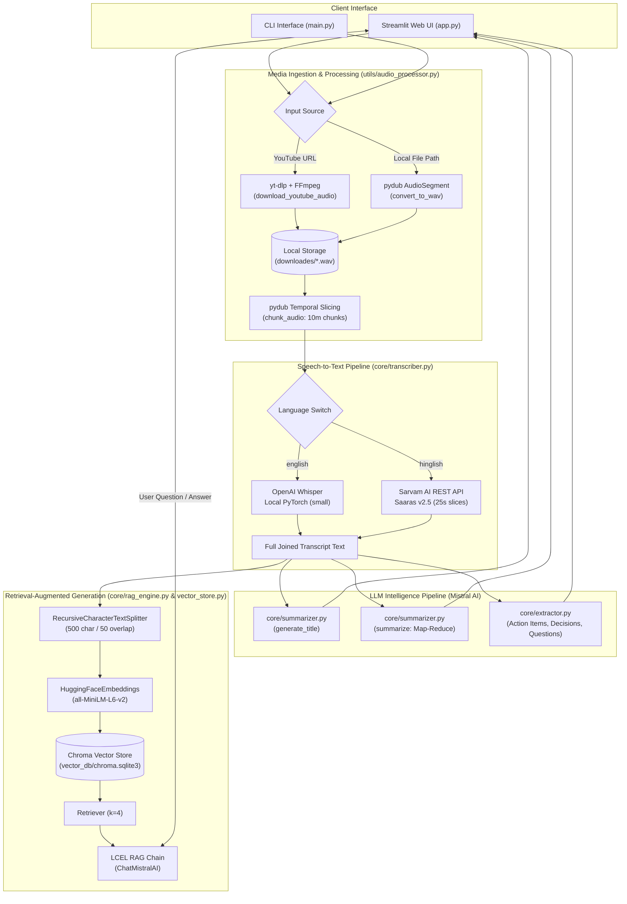

# Gistly — AI Meeting & Video Intelligence Assistant
## Comprehensive Technical Audit & System Diagnosis Report

> [!NOTE] Historical Audit Artifact
> This document is the original **Phase 1 System Diagnosis & Reliability Audit** conducted on September 25, 2026. It preserves the initial diagnostic baseline and fatal blockers before the iterative stabilization passes (Phases 2–9) and subsequent architectural modernizations (FastAPI REST service layer, LangGraph orchestration, Google Gemini multi-provider LLM support, and modular package structure).
> For the current system architecture, refer to the root [README.md](../../README.md) and the [Reports Index](../README.md).

---

### Executive Summary

| Attribute | Details |
| :--- | :--- |
| **Project Name** | Gistly — AI Meeting & Video Intelligence Assistant |
| **Repository Path** | `c:\Users\DELL\OneDrive\Desktop\New folder\Gistly-AI-Meeting-Video-Intelligence-Assistant-` |
| **Auditor Role** | Senior Software Architect + Debugging Engineer + AI System Auditor |
| **Date** | September 25, 2026 |
| **Overall System Health** | **Fragile / Non-Operational in Current State (Historical Baseline)** |
| **Primary Blockers** | Missing required API credentials (`MISTRAL_API_KEY`, `SARVAM_API_KEY`), fatal environment variable evaluation order in `transcriber.py`, missing positional argument in `load_rag_chain`, persistent vector store cross-contamination, and large committed binary artifacts (>217 MB). |

---

## 1. Project Overview

**Gistly** is designed as a multimodal meeting and video intelligence assistant. Its core purpose is to ingest meeting recordings or educational video content (via a YouTube URL or local file path), extract the audio track, transcribe speech into English text using either local OpenAI Whisper or Sarvam AI's speech-to-text-translate API (Hindi $\rightarrow$ English), generate a session title and hierarchical summary using Mistral AI, extract structured action items, key decisions, and open questions, and finally index the transcript into a Chroma vector database to provide a Retrieval-Augmented Generation (RAG) conversational interface.

The application provides two interaction interfaces:
1. **Web Interface**: A custom-styled [Streamlit](file:///c:/Users/DELL/OneDrive/Desktop/New%20folder/Gistly-AI-Meeting-Video-Intelligence-Assistant-/app.py) application ([app.py](file:///c:/Users/DELL/OneDrive/Desktop/New%20folder/Gistly-AI-Meeting-Video-Intelligence-Assistant-/app.py)).
2. **CLI Interface**: A terminal script ([main.py](file:///c:/Users/DELL/OneDrive/Desktop/New%20folder/Gistly-AI-Meeting-Video-Intelligence-Assistant-/main.py)).

---

## 2. Actual Technology Stack

An inspection of the repository reveals the following actual technology inventory:

### Frontend
* **UI Framework**: Streamlit ($\ge 1.35.0$) running a single-page script in [app.py](file:///c:/Users/DELL/OneDrive/Desktop/New%20folder/Gistly-AI-Meeting-Video-Intelligence-Assistant-/app.py).
* **Styling**: Injected custom raw CSS (`st.markdown("""<style>...</style>""", unsafe_allow_html=True)`) using Google Fonts (*Playfair Display*, *Cormorant Garamond*, *Jost*), CSS custom properties (`--bg`, `--surface`, `--accent`), and hand-crafted HTML/CSS card components.
* **State Management**: Streamlit session state (`st.session_state`) for tracking pipeline status, output dictionary, and chat message history.
* **Client-Server Communication**: Streamlit WebSocket execution loop (standard Streamlit execution model).

### Backend / Orchestration
* **Language & Runtime**: Python 3.10+ (Host environment has Python 3.13.1 and `uv`-managed Python 3.11.15).
* **Execution Model**: Monolithic synchronous Python process. The Streamlit script directly imports and executes the backend services inline upon button press.
* **CLI Entry Points**: [main.py](file:///c:/Users/DELL/OneDrive/Desktop/New%20folder/Gistly-AI-Meeting-Video-Intelligence-Assistant-/main.py) and [test.py](file:///c:/Users/DELL/OneDrive/Desktop/New%20folder/Gistly-AI-Meeting-Video-Intelligence-Assistant-/test.py).

### AI & Media Processing
* **Speech-to-Text**:
  * English: `openai-whisper` (local PyTorch-based model, defaulting to model weight `"small"`).
  * Hindi / Hinglish: Cloud REST API calls via `requests` to Sarvam AI (`https://api.sarvam.ai/speech-to-text-translate` with model `"saaras:v2.5"`).
* **LLM Engine**: Mistral AI model `mistral-small-latest` accessed via `langchain-mistralai` (`ChatMistralAI`).
* **Orchestration**: LangChain Expression Language (LCEL) pipelines using `RunnablePassthrough`, `RunnableLambda`, `ChatPromptTemplate`, and `StrOutputParser`.
* **RAG / Vector Database**:
  * Vector Store: `ChromaDB` via `langchain-chroma` (persisted to a local folder named `vector_db/`).
  * Embeddings: HuggingFace `sentence-transformers` model `all-MiniLM-L6-v2` loaded on CPU via `langchain_community.embeddings.HuggingFaceEmbeddings`.
  * Chunking: `langchain_text_splitters.RecursiveCharacterTextSplitter`.
* **Media & Audio Manipulation**:
  * `yt-dlp` for YouTube audio downloading and FFmpeg stream extraction.
  * `pydub` (`AudioSegment`) for audio format normalization (16kHz mono WAV) and temporal audio slicing (10-minute chunks for Whisper; 25-second slices for Sarvam AI).
  * System executable `ffmpeg` (available at `C:\Users\DELL\AppData\Local\Microsoft\WinGet\Packages\Gyan.FFmpeg_Microsoft.Winget.Source_8wekyb3d8bbwe\ffmpeg-8.1.2-full_build\bin\ffmpeg.exe`).

### Infrastructure & Storage
* **Database**: Local embedded SQLite backing ChromaDB (`vector_db/chroma.sqlite3`).
* **Object / File Storage**: Local directory [downloades/](file:///c:/Users/DELL/OneDrive/Desktop/New%20folder/Gistly-AI-Meeting-Video-Intelligence-Assistant-/downloades) for downloaded and converted audio files.
* **Deployment Configuration**: [packages.txt](file:///c:/Users/DELL/OneDrive/Desktop/New%20folder/Gistly-AI-Meeting-Video-Intelligence-Assistant-/packages.txt) (Debian `ffmpeg` dependency for Hugging Face Spaces).

---

## 3. Repository Structure

```text
Gistly-AI-Meeting-Video-Intelligence-Assistant-/
├── .git/                                # Git version control metadata
├── .gitignore                           # Git ignore definitions
├── app.py                               # Streamlit UI & interactive pipeline execution (554 lines)
├── main.py                              # CLI interface entry point (65 lines)
├── test.py                              # Integration test script with hardcoded YouTube URL (54 lines)
├── packages.txt                         # System-level dependencies for Hugging Face Spaces (ffmpeg)
├── requirements.txt                     # Python dependencies specification (46 lines)
├── README.md                            # Project documentation
│
├── core/                                # Core AI, transcription, and RAG logic
│   ├── extractor.py                     # Action items, key decisions, open questions extraction
│   ├── rag_engine.py                    # LCEL RAG chain construction and query invocation
│   ├── summarizer.py                    # Map-reduce summarization and title generation
│   ├── transcriber.py                   # Whisper (local) and Sarvam AI (REST) transcription
│   └── vector_store.py                  # ChromaDB vector store initialization and retriever factory
│
├── utils/                               # Media helper utilities
│   └── audio_processor.py               # yt-dlp download, WAV conversion, and temporal chunking
│
├── downloades/                          # Audio artifact storage directory (Typo in name: 'downloades')
│   ├── 5 AI PM Projects...wav           # ⚠️ 101.9 MB uncommitted artifact checked into git
│   ├── 5 AI PM Projects...chunk_0.wav   # ⚠️ 101.9 MB uncommitted chunk checked into git
│   └── Raghu Ram & GENi...webm          # ⚠️ 14.2 MB uncommitted webm file checked into git
│
└── vector_db/                           # Persistent ChromaDB storage directory
    ├── chroma.sqlite3                   # ⚠️ 425 KB pre-existing SQLite database checked into git
    └── fa4aa5a9-0c69-41.../             # ⚠️ 167 KB HNSW binary index files checked into git
```

---

## 4. Architecture Diagram



---

## 5. Complete Data Flow

Tracing the end-to-end execution path for a meeting recording:

| Stage | Module & Function | Input | Output | External Dependencies | Failure / Risk Points |
| :--- | :--- | :--- | :--- | :--- | :--- |
| **1. Ingestion** | [`process_input`](file:///c:/Users/DELL/OneDrive/Desktop/New%20folder/Gistly-AI-Meeting-Video-Intelligence-Assistant-/utils/audio_processor.py#L54-L65) $\rightarrow$ [`download_youtube_audio`](file:///c:/Users/DELL/OneDrive/Desktop/New%20folder/Gistly-AI-Meeting-Video-Intelligence-Assistant-/utils/audio_processor.py#L8-L25) or [`convert_to_wav`](file:///c:/Users/DELL/OneDrive/Desktop/New%20folder/Gistly-AI-Meeting-Video-Intelligence-Assistant-/utils/audio_processor.py#L29-L35) | URL string or local file path | Path to master `.wav` file on disk | `yt-dlp`, `ffmpeg`, `pydub` | 1. If yt-dlp extracts `.opus`, hardcoded `.replace(".webm", ".wav")` fails to rename, causing `FileNotFoundError`.<br>2. Local paths fail on remote web servers.<br>3. YouTube bot detection / IP rate-limiting. |
| **2. Chunking** | [`chunk_audio`](file:///c:/Users/DELL/OneDrive/Desktop/New%20folder/Gistly-AI-Meeting-Video-Intelligence-Assistant-/utils/audio_processor.py#L39-L52) | Master `.wav` path, `chunk_minutes=10` | List of chunk file paths (`*_chunk_i.wav`) | `pydub` | Multi-gigabyte disk consumption; files are never cleaned up. |
| **3. Transcription** | [`transcribe_all`](file:///c:/Users/DELL/OneDrive/Desktop/New%20folder/Gistly-AI-Meeting-Video-Intelligence-Assistant-/core/transcriber.py#L106-L124) $\rightarrow$ [`transcribe_chunk`](file:///c:/Users/DELL/OneDrive/Desktop/New%20folder/Gistly-AI-Meeting-Video-Intelligence-Assistant-/core/transcriber.py#L95-L103) | Chunk paths, `language` flag | Concatenated raw transcript string | `openai-whisper`, `torch`, `ffmpeg`, Sarvam AI API | 1. Top-level `SARVAM_API_KEY` evaluated before `load_dotenv()`, causing immediate failure in Hinglish mode.<br>2. Whisper on CPU is extremely slow.<br>3. Deprecated Sarvam endpoint. |
| **4. Title & Summarization** | [`generate_title`](file:///c:/Users/DELL/OneDrive/Desktop/New%20folder/Gistly-AI-Meeting-Video-Intelligence-Assistant-/core/summarizer.py#L56-L75), [`summarize`](file:///c:/Users/DELL/OneDrive/Desktop/New%20folder/Gistly-AI-Meeting-Video-Intelligence-Assistant-/core/summarizer.py#L21-L55) | Full transcript string | Short title string; Markdown bullet-point summary | Mistral API (`mistral-small-latest`), LangChain | 1. Missing `MISTRAL_API_KEY`.<br>2. Empty transcript causes empty chunk list crash.<br>3. Map-reduce executes 2 LLM passes even on short text. |
| **5. Structured Extraction** | [`extract_action_items`](file:///c:/Users/DELL/OneDrive/Desktop/New%20folder/Gistly-AI-Meeting-Video-Intelligence-Assistant-/core/extractor.py#L24-L35), [`extract_key_decisions`](file:///c:/Users/DELL/OneDrive/Desktop/New%20folder/Gistly-AI-Meeting-Video-Intelligence-Assistant-/core/extractor.py#L37-L44), [`extract_questions`](file:///c:/Users/DELL/OneDrive/Desktop/New%20folder/Gistly-AI-Meeting-Video-Intelligence-Assistant-/core/extractor.py#L46-L52) | Full transcript string | Formatted strings with tasks, decisions, questions | Mistral API | 3 un-chunked full-transcript LLM calls run sequentially; risk of token limits and timeouts on long recordings. |
| **6. Vector Indexing** | [`build_vector_store`](file:///c:/Users/DELL/OneDrive/Desktop/New%20folder/Gistly-AI-Meeting-Video-Intelligence-Assistant-/core/vector_store.py#L17-L40) | Full transcript string | `Chroma` vector store instance | `sentence-transformers`, `chromadb`, PyTorch | 1. Appends documents into existing `vector_db` without resetting or session tagging.<br>2. Cross-pollutes transcripts across multiple runs. |
| **7. RAG Chain Construction** | [`build_rag_chain`](file:///c:/Users/DELL/OneDrive/Desktop/New%20folder/Gistly-AI-Meeting-Video-Intelligence-Assistant-/core/rag_engine.py#L18-L56) | Vector store instance | LCEL Runnable chain | LangChain LCEL, Mistral API | Single-turn RAG only; zero conversation history is passed. |
| **8. Chat Execution** | [`ask_question`](file:///c:/Users/DELL/OneDrive/Desktop/New%20folder/Gistly-AI-Meeting-Video-Intelligence-Assistant-/core/rag_engine.py#L93-L97) via [app.py](file:///c:/Users/DELL/OneDrive/Desktop/New%20folder/Gistly-AI-Meeting-Video-Intelligence-Assistant-/app.py#L526-L531) | User query string | LLM answer string | Mistral API | 1. Hitting Enter in `st.text_input` does not submit query.<br>2. Unsanitized strings rendered into `st.markdown(..., unsafe_allow_html=True)`. |

---

## 6. Feature Inventory

| Feature | Stated in README | Code Exists | Status | Reality & Deficiencies |
| :--- | :---: | :---: | :---: | :--- |
| **YouTube Ingestion** | Yes | Yes | **Partially Implemented** | Works if YouTube serves `.webm`/`.m4a`, but breaks if `.opus` is returned. Vulnerable to YouTube bot blocks. |
| **Local File Path Ingestion** | Yes | Yes | **Partially Implemented** | Works on local developer machine, but fails completely when deployed to cloud/Hugging Face Spaces because client cannot supply local paths via a text box. |
| **English Transcription (Whisper)** | Yes | Yes | **Implemented** | Works, but requires local PyTorch and FFmpeg in PATH. Sequential CPU processing is slow. |
| **Hindi Transcription (Sarvam AI)** | Yes | Yes | **Broken** | Crashes on startup with `RuntimeError: SARVAM_API_KEY is not set` due to module import ordering. Also targets deprecated endpoint. |
| **Automatic Summarization** | Yes | Yes | **Implemented** | Map-reduce summarization via Mistral AI functions correctly if API key is provided. |
| **Structured Extraction** | Yes | Yes | **Implemented** | Extracts action items, decisions, questions via 3 sequential LLM prompts. |
| **RAG Interactive Chat** | Yes | Yes | **Partially Implemented** | Single-turn RAG functions, but cross-contaminates multiple meetings in the vector store and ignores conversation history. UI submit button logic is flawed. |
| **PDF & TXT Export** | Claimed in `requirements.txt` | No | **Planned / Placeholder** | Dependencies `reportlab` and `fpdf2` are declared in `requirements.txt`, but zero export code exists in the repository. |
| **Hindi Translation via deep-translator**| Claimed in `requirements.txt` | No | **Planned / Placeholder** | Declared in `requirements.txt`, never imported or referenced. |
| **Real-time Pipeline Status Bar** | Implied in UI | Yes | **Broken** | The sidebar status bar is guarded by `if st.session_state.pipeline_done:`, meaning it is completely hidden while the pipeline runs. |

---

## 7. Frontend Audit

File: [app.py](file:///c:/Users/DELL/OneDrive/Desktop/New%20folder/Gistly-AI-Meeting-Video-Intelligence-Assistant-/app.py)

1. **Broken Enter-Key Submission in Chat** ([app.py:520-531](file:///c:/Users/DELL/OneDrive/Desktop/New%20folder/Gistly-AI-Meeting-Video-Intelligence-Assistant-/app.py#L520-L531)):
   ```python
   user_input = st.text_input("Your question", placeholder="...", label_visibility="collapsed")
   send_btn = st.button("Send →", use_container_width=True)
   if send_btn and user_input.strip():
       answer = ask_question(r["rag_chain"], user_input.strip())
   ```
   When a user types a question in Streamlit and presses Enter, Streamlit reruns the script with `user_input` populated, but `send_btn` is `False`. The message is ignored. The user is forced to physically click "Send $\rightarrow$". Furthermore, the input field is not cleared upon sending.
2. **Invisible Live Progress Indicator** ([app.py:354-366](file:///c:/Users/DELL/OneDrive/Desktop/New%20folder/Gistly-AI-Meeting-Video-Intelligence-Assistant-/app.py#L354-L366)):
   The sidebar status component is inside `if st.session_state.pipeline_done:`. During pipeline execution, `pipeline_done` is `False`. The UI informs the user *"see sidebar for live status…"*, but nothing appears in the sidebar until the entire pipeline completes.
3. **Markdown List Rendering Broken by HTML Wrapping** ([app.py:456-487](file:///c:/Users/DELL/OneDrive/Desktop/New%20folder/Gistly-AI-Meeting-Video-Intelligence-Assistant-/app.py#L456-L487)):
   The LLM generates Markdown lists (e.g. `1. Task\n2. Task`). In [app.py](file:///c:/Users/DELL/OneDrive/Desktop/New%20folder/Gistly-AI-Meeting-Video-Intelligence-Assistant-/app.py), these are interpolated directly into raw HTML: `<div class="card-content">{r['action_items']}</div>`. In HTML, newline characters without `<br>` or `<p>` tags collapse into single spaces, rendering formatted bullet points as unformatted run-on text.
4. **Missing Native File Uploader**:
   [app.py](file:///c:/Users/DELL/OneDrive/Desktop/New%20folder/Gistly-AI-Meeting-Video-Intelligence-Assistant-/app.py#L348) provides only `st.text_input` for file paths. It lacks `st.file_uploader`, making it impossible for remote users on web deployments (like Hugging Face Spaces) to upload files.

---

## 8. Backend Audit

Files: [main.py](file:///c:/Users/DELL/OneDrive/Desktop/New%20folder/Gistly-AI-Meeting-Video-Intelligence-Assistant-/main.py), [test.py](file:///c:/Users/DELL/OneDrive/Desktop/New%20folder/Gistly-AI-Meeting-Video-Intelligence-Assistant-/test.py), [utils/audio_processor.py](file:///c:/Users/DELL/OneDrive/Desktop/New%20folder/Gistly-AI-Meeting-Video-Intelligence-Assistant-/utils/audio_processor.py)

1. **Premature Module-Level Environment Variable Evaluation** ([core/transcriber.py:14](file:///c:/Users/DELL/OneDrive/Desktop/New%20folder/Gistly-AI-Meeting-Video-Intelligence-Assistant-/core/transcriber.py#L14)):
   In [app.py:5](file:///c:/Users/DELL/OneDrive/Desktop/New%20folder/Gistly-AI-Meeting-Video-Intelligence-Assistant-/app.py#L5) and [main.py:3](file:///c:/Users/DELL/OneDrive/Desktop/New%20folder/Gistly-AI-Meeting-Video-Intelligence-Assistant-/main.py#L3), `core.transcriber` is imported **before** `load_dotenv()` is called. At import time, `os.getenv("SARVAM_API_KEY")` evaluates to `None`. Any subsequent call to [`transcribe_chunk_sarvam`](file:///c:/Users/DELL/OneDrive/Desktop/New%20folder/Gistly-AI-Meeting-Video-Intelligence-Assistant-/core/transcriber.py#L63-L90) raises `RuntimeError: SARVAM_API_KEY is not set in environment / .env` even if `.env` exists.
2. **Missing Argument Crash in `load_rag_chain`** ([core/rag_engine.py:60](file:///c:/Users/DELL/OneDrive/Desktop/New%20folder/Gistly-AI-Meeting-Video-Intelligence-Assistant-/core/rag_engine.py#L60)):
   ```python
   def load_rag_chain():
       vector_store = load_vector_store()
       retriver = get_retriever()  # <-- CRASH: TypeError
   ```
   [`get_retriever`](file:///c:/Users/DELL/OneDrive/Desktop/New%20folder/Gistly-AI-Meeting-Video-Intelligence-Assistant-/core/vector_store.py#L53) requires `vector_store` as a mandatory positional argument (`def get_retriever(vector_store: Chroma, k: int = 4):`). Calling `load_rag_chain()` immediately crashes.
3. **Flawed Extension Replacement in `download_youtube_audio`** ([utils/audio_processor.py:24](file:///c:/Users/DELL/OneDrive/Desktop/New%20folder/Gistly-AI-Meeting-Video-Intelligence-Assistant-/utils/audio_processor.py#L24)):
   `filename = ydl.prepare_filename(info).replace(".webm", ".wav").replace(".m4a", ".wav")`
   If YouTube delivers audio in an Opus container (`.opus`), this replace chain leaves the `.opus` extension untouched, while FFmpeg extracted it to `.wav`. The returned path does not exist, causing `chunk_audio` to crash with `FileNotFoundError`.
4. **Disk Leak & Storage Accumulation**:
   Downloaded audio files and temporal chunk WAVs (`*_chunk_0.wav`) are written to `downloades/` and never deleted after transcription. Over time, this causes disk space exhaustion.

---

## 9. Database Audit

Files: [core/vector_store.py](file:///c:/Users/DELL/OneDrive/Desktop/New%20folder/Gistly-AI-Meeting-Video-Intelligence-Assistant-/core/vector_store.py), `vector_db/chroma.sqlite3`

1. **Cross-Meeting Vector Store Contamination**:
   In [core/vector_store.py:32-37](file:///c:/Users/DELL/OneDrive/Desktop/New%20folder/Gistly-AI-Meeting-Video-Intelligence-Assistant-/core/vector_store.py#L32-L37):
   ```python
   vector_store = Chroma.from_documents(
       documents=docs,
       embedding=embeddings,
       collection_name=COLLECTION_NAME,
       persist_directory=CHROMA_DIR
   )
   ```
   `Chroma.from_documents` appends documents to the collection without resetting existing data.
   * Direct verification in SQLite:
     Inspection of `vector_db/chroma.sqlite3` reveals **26 documents** already committed to Git from a prior video (*"5 AI PM Projects to Get Hired in 2026 | Ex-Amazon"*).
   * When a user analyzes a new video, its chunks are added alongside the existing 26 chunks.
   * Queries on the new video will return passages from the previous video.
2. **Missing Metadata Isolation**:
   Documents are indexed with metadata `{'chunk_index': i}` only. There is no `video_id`, `session_id`, or `created_at` timestamp to partition or filter results.
3. **Committed Database Artifacts**:
   `vector_db/chroma.sqlite3` and binary index directories (`fa4aa5a9-...`) were committed to Git repository instead of being generated dynamically in runtime scratch space.

---

## 10. AI / LLM Audit

Files: [core/summarizer.py](file:///c:/Users/DELL/OneDrive/Desktop/New%20folder/Gistly-AI-Meeting-Video-Intelligence-Assistant-/core/summarizer.py), [core/extractor.py](file:///c:/Users/DELL/OneDrive/Desktop/New%20folder/Gistly-AI-Meeting-Video-Intelligence-Assistant-/core/extractor.py), [core/rag_engine.py](file:///c:/Users/DELL/OneDrive/Desktop/New%20folder/Gistly-AI-Meeting-Video-Intelligence-Assistant-/core/rag_engine.py)

1. **Stateless Single-Turn RAG Chat**:
   The RAG chain prompt in [core/rag_engine.py:28-42](file:///c:/Users/DELL/OneDrive/Desktop/New%20folder/Gistly-AI-Meeting-Video-Intelligence-Assistant-/core/rag_engine.py#L28-L42) only accepts `{context}` and `{question}`. In [app.py:528](file:///c:/Users/DELL/OneDrive/Desktop/New%20folder/Gistly-AI-Meeting-Video-Intelligence-Assistant-/app.py#L528), questions are passed without previous conversation history. Conversational references (e.g. *"What did she say about that?"*, *"Elaborate on point 2"*) cannot resolve co-references.
2. **Context Window Risks in Extraction**:
   [core/summarizer.py](file:///c:/Users/DELL/OneDrive/Desktop/New%20folder/Gistly-AI-Meeting-Video-Intelligence-Assistant-/core/summarizer.py) splits transcripts into 3,000-character segments. However, [core/extractor.py](file:///c:/Users/DELL/OneDrive/Desktop/New%20folder/Gistly-AI-Meeting-Video-Intelligence-Assistant-/core/extractor.py#L34-L52) passes the entire un-chunked transcript into three separate LLM calls. For longer meetings (1–2 hours), this risks exceeding token limits and causing API timeouts.
3. **Empty Transcript Vulnerability**:
   If audio transcription yields empty text (due to silence or extraction errors), `split_transcript("")` returns `[]`. In [core/summarizer.py:35](file:///c:/Users/DELL/OneDrive/Desktop/New%20folder/Gistly-AI-Meeting-Video-Intelligence-Assistant-/core/summarizer.py#L35), `chunk_summaries` becomes `[]`, and `combined_chain.invoke("")` sends an empty prompt to Mistral AI.
4. **Duplicated LLM Client Instantiation**:
   `get_llm()` is redundantly defined across `summarizer.py`, `extractor.py`, and `rag_engine.py` with slight temperature variations (0.3 vs 0.2) rather than being centrally configured.

---

## 11. Video / Audio Pipeline Audit

Files: [utils/audio_processor.py](file:///c:/Users/DELL/OneDrive/Desktop/New%20folder/Gistly-AI-Meeting-Video-Intelligence-Assistant-/utils/audio_processor.py), [core/transcriber.py](file:///c:/Users/DELL/OneDrive/Desktop/New%20folder/Gistly-AI-Meeting-Video-Intelligence-Assistant-/core/transcriber.py)

1. **Large Binary Files Committed to Git**:
   Over **217 MB** of audio/video files are committed in [downloades/](file:///c:/Users/DELL/OneDrive/Desktop/New%20folder/Gistly-AI-Meeting-Video-Intelligence-Assistant-/downloades):
   - `5 AI PM Projects to Get Hired in 2026 | Ex-Amazon.wav` (101,929,038 bytes)
   - `5 AI PM Projects to Get Hired in 2026 | Ex-Amazon.wav_chunk_0.wav` (101,929,004 bytes)
   - `Raghu Ram & GENi React To INDIA'S GOT LATENT S2 EP3 | Netflix India.webm` (14,210,204 bytes)
   The 101.9 MB file exceeds GitHub’s standard 100 MB per-file threshold and risks repository blocking.
2. **Deprecated Sarvam AI STT Endpoint**:
   [core/transcriber.py:15-16](file:///c:/Users/DELL/OneDrive/Desktop/New%20folder/Gistly-AI-Meeting-Video-Intelligence-Assistant-/core/transcriber.py#L15-L16) uses `https://api.sarvam.ai/speech-to-text-translate` with model `saaras:v2.5`. Sarvam AI has marked `/speech-to-text-translate` and `saaras:v2.5` as legacy/deprecated; current integrations use `/speech-to-text` with `mode="translate"` and `saaras:v3` or `saaras:v4`.
3. **Synchronous CPU Whisper Bottleneck**:
   Whisper `"small"` runs on CPU by default. Processing a 30-minute recording involves three 10-minute chunks transcribed sequentially, blocking the single Streamlit process for 15+ minutes without incremental streaming.
4. **Hardcoded Folder Typo**:
   `DOWNLOAD_DIR = 'downloades'` in [utils/audio_processor.py:5](file:///c:/Users/DELL/OneDrive/Desktop/New%20folder/Gistly-AI-Meeting-Video-Intelligence-Assistant-/utils/audio_processor.py#L5).

---

## 12. API Contract Audit

The application acts as both a consumer of external APIs and an internal consumer of service functions:

| Method / Call | Target Endpoint / Function | Caller | Request Payload / Arguments | Expected Response | Issues Found |
| :--- | :--- | :--- | :--- | :--- | :--- |
| `POST` | `https://api.sarvam.ai/speech-to-text-translate` | [`_send_to_sarvam`](file:///c:/Users/DELL/OneDrive/Desktop/New%20folder/Gistly-AI-Meeting-Video-Intelligence-Assistant-/core/transcriber.py#L40-L60) | Multipart: `file` (WAV), `model="saaras:v2.5"`, `with_diarization="false"` | JSON: `{"transcript": "..."}` | 1. `SARVAM_API_KEY` header evaluates to `None`.<br>2. Endpoint and model are deprecated by Sarvam. |
| `POST` | Mistral AI API (`chat/completions`) | `ChatMistralAI` in `summarizer`, `extractor`, `rag_engine` | Chat messages with prompt and context | Chat completion output | 1. Fails if `MISTRAL_API_KEY` is unset.<br>2. No retry on 429 rate limit or timeout. |
| Python Call | [`get_retriever(vector_store, k=4)`](file:///c:/Users/DELL/OneDrive/Desktop/New%20folder/Gistly-AI-Meeting-Video-Intelligence-Assistant-/core/vector_store.py#L53) | [`load_rag_chain`](file:///c:/Users/DELL/OneDrive/Desktop/New%20folder/Gistly-AI-Meeting-Video-Intelligence-Assistant-/core/rag_engine.py#L60) | None passed | `VectorStoreRetriever` | **Fatal Contract Mismatch**: Called with 0 arguments; requires `vector_store`. |
| Python Call | `AudioSegment.from_wav(wav_path)` | [`chunk_audio`](file:///c:/Users/DELL/OneDrive/Desktop/New%20folder/Gistly-AI-Meeting-Video-Intelligence-Assistant-/utils/audio_processor.py#L40) | File path | `AudioSegment` | Crashes with `FileNotFoundError` if `download_youtube_audio` returns an un-replaced `.opus` extension. |

---

## 13. Environment Configuration Audit

Configuration variables identified across the repository:

| Variable | Required | Default in Code | Purpose | Status in Environment |
| :--- | :---: | :---: | :--- | :--- |
| `MISTRAL_API_KEY` | **Yes** | None | Required for all summarization, extraction, and RAG chat. | **Missing** (Not in OS env, no `.env` file) |
| `SARVAM_API_KEY` | Conditional | None | Required if Hindi/Hinglish language option is selected. | **Missing** (Not in OS env, no `.env` file) |
| `WHISPER_MODEL` | No | `"small"` | Specifies local Whisper model size (`tiny`, `base`, `small`, etc.). | Unset (uses default) |
| `SARVAM_STT_MODEL` | No | `"saaras:v2.5"` | Specifies Sarvam AI speech model identifier. | Unset (uses default) |

### Configuration Deficiencies
1. **No `.env` or `.env.example` File**: No sample configuration template exists in the repository.
2. **Order-of-Operations Bug**: In both [app.py](file:///c:/Users/DELL/OneDrive/Desktop/New%20folder/Gistly-AI-Meeting-Video-Intelligence-Assistant-/app.py#L5) and [main.py](file:///c:/Users/DELL/OneDrive/Desktop/New%20folder/Gistly-AI-Meeting-Video-Intelligence-Assistant-/main.py#L3), imports occur before `load_dotenv()`, rendering top-level environment variable reads useless.

---

## 14. Security Audit

1. **Cross-Site Scripting (XSS) / Unsanitized HTML Injection**:
   In [app.py:463, 502, 508](file:///c:/Users/DELL/OneDrive/Desktop/New%20folder/Gistly-AI-Meeting-Video-Intelligence-Assistant-/app.py#L463), user chat inputs and meeting transcripts are injected directly into `st.markdown(..., unsafe_allow_html=True)` without HTML escaping:
   ```python
   st.markdown(f'<div class="transcript-box">{r["transcript"]}</div>', unsafe_allow_html=True)
   <div class="chat-bubble user-bubble">{msg['content']}</div>
   ```
   A transcript containing HTML/JavaScript or malicious input in chat is rendered raw in the browser DOM.
2. **Missing Input Validation & Path Traversal Risk**:
   In [app.py:348](file:///c:/Users/DELL/OneDrive/Desktop/New%20folder/Gistly-AI-Meeting-Video-Intelligence-Assistant-/app.py#L348) and [utils/audio_processor.py:60](file:///c:/Users/DELL/OneDrive/Desktop/New%20folder/Gistly-AI-Meeting-Video-Intelligence-Assistant-/utils/audio_processor.py#L60), the local file path string is passed directly to `convert_to_wav` without sanitization or path traversal protection.
3. **Data Contamination & Multi-User Privacy**:
   Because `vector_db/` is a shared global folder on disk, transcripts from multiple different users or meetings are commingled in the same Chroma collection. A user chatting in session B can retrieve sensitive meeting data from session A.

---

## 15. Testing Audit

1. **Zero Automated Unit Tests**: There are no `pytest` or `unittest` test suites anywhere in the repository.
2. **Flawed Integration Script** ([test.py](file:///c:/Users/DELL/OneDrive/Desktop/New%20folder/Gistly-AI-Meeting-Video-Intelligence-Assistant-/test.py)):
   [test.py](file:///c:/Users/DELL/OneDrive/Desktop/New%20folder/Gistly-AI-Meeting-Video-Intelligence-Assistant-/test.py) is a manual runner that hardcodes a live YouTube URL (`https://www.youtube.com/watch?v=_Q-e_nczWqM&t=223s`). Running it requires network access, YouTube availability, FFmpeg, Whisper weights download, and a valid `MISTRAL_API_KEY`. It contains no assertions.
3. **Missing CI/CD**: No GitHub Actions or CI workflows exist to run linting, type checks, or tests.

---

## 16. Documentation vs Implementation

| Documentation Claim in README | Reality in Codebase | Discrepancy Status |
| :--- | :--- | :---: |
| *"pip install -r Requirements.txt"* | File is lowercase `requirements.txt`. On Linux/macOS case-sensitive filesystems, this command fails. | **Outdated / Inconsistent** |
| *"Accepts a local file path"* | Implemented only as a text box in `app.py`. Fails on remote/cloud deployments. | **Partially Implemented** |
| *"PDF & TXT Export"* | Dependencies `reportlab` and `fpdf2` are declared in `requirements.txt`, but no export functionality exists. | **Missing / Phantom Claim** |
| *"deep-translator (Hindi $\rightarrow$ English)"* | Listed in `requirements.txt`, but never used in code. | **Missing / Phantom Claim** |
| *"Flexible clean UI"* | Bulleted lists render without line breaks due to HTML card encapsulation; Enter key does not submit questions. | **Partially Broken** |

---

## 17. Issues Found

| ID | Severity | Issue | Root Cause | Evidence | Recommended Action |
| :--- | :---: | :--- | :--- | :--- | :--- |
| **ISS-01** | **P0** | Hinglish transcription fails on startup with `RuntimeError: SARVAM_API_KEY is not set` | Module-level `SARVAM_API_KEY = os.getenv(...)` executed at import time before `load_dotenv()` runs in `app.py` and `main.py`. | [core/transcriber.py:14](file:///c:/Users/DELL/OneDrive/Desktop/New%20folder/Gistly-AI-Meeting-Video-Intelligence-Assistant-/core/transcriber.py#L14)<br>[app.py:5, 10](file:///c:/Users/DELL/OneDrive/Desktop/New%20folder/Gistly-AI-Meeting-Video-Intelligence-Assistant-/app.py#L5)<br>[main.py:3, 9](file:///c:/Users/DELL/OneDrive/Desktop/New%20folder/Gistly-AI-Meeting-Video-Intelligence-Assistant-/main.py#L3) | Fetch `SARVAM_API_KEY` dynamically inside functions or ensure `load_dotenv()` runs prior to any core module import. |
| **ISS-02** | **P1** | `load_rag_chain` crashes with `TypeError` | [`get_retriever()`](file:///c:/Users/DELL/OneDrive/Desktop/New%20folder/Gistly-AI-Meeting-Video-Intelligence-Assistant-/core/rag_engine.py#L60) called without passing the required `vector_store` argument. | [core/rag_engine.py:60](file:///c:/Users/DELL/OneDrive/Desktop/New%20folder/Gistly-AI-Meeting-Video-Intelligence-Assistant-/core/rag_engine.py#L60)<br>[core/vector_store.py:53](file:///c:/Users/DELL/OneDrive/Desktop/New%20folder/Gistly-AI-Meeting-Video-Intelligence-Assistant-/core/vector_store.py#L53) | Update call to `get_retriever(vector_store)`. |
| **ISS-03** | **P1** | Vector store cross-contaminates transcripts across meetings | `build_vector_store` always appends to the same static collection in `vector_db/` without resetting or session namespacing. | [core/vector_store.py:32-37](file:///c:/Users/DELL/OneDrive/Desktop/New%20folder/Gistly-AI-Meeting-Video-Intelligence-Assistant-/core/vector_store.py#L32-L37) | Use unique session collection names or reset the collection before ingesting a new meeting. |
| **ISS-04** | **P1** | Committed large binary files (>217 MB) & database in Git | `downloades/` and `vector_db/` were not included in `.gitignore` prior to committing. | [downloades/](file:///c:/Users/DELL/OneDrive/Desktop/New%20folder/Gistly-AI-Meeting-Video-Intelligence-Assistant-/downloades)<br>[.gitignore](file:///c:/Users/DELL/OneDrive/Desktop/New%20folder/Gistly-AI-Meeting-Video-Intelligence-Assistant-/.gitignore) | Untrack binary media files and SQLite database from Git; add to `.gitignore`. |
| **ISS-05** | **P1** | Audio files leak and permanently consume disk space | `chunk_audio` and `download_youtube_audio` write WAV files but provide no cleanup mechanism. | [utils/audio_processor.py:48](file:///c:/Users/DELL/OneDrive/Desktop/New%20folder/Gistly-AI-Meeting-Video-Intelligence-Assistant-/utils/audio_processor.py#L48) | Add a cleanup utility to delete temporary chunks and downloaded audio once transcription completes. |
| **ISS-06** | **P2** | `download_youtube_audio` fails with `FileNotFoundError` on non-webm/m4a streams | Hardcoded `.replace(".webm", ".wav").replace(".m4a", ".wav")` fails when YouTube audio is Opus. | [utils/audio_processor.py:24](file:///c:/Users/DELL/OneDrive/Desktop/New%20folder/Gistly-AI-Meeting-Video-Intelligence-Assistant-/utils/audio_processor.py#L24) | Use `os.path.splitext(ydl.prepare_filename(info))[0] + ".wav"`. |
| **ISS-07** | **P2** | Enter key does not submit questions in Streamlit chat | `if send_btn and user_input.strip():` only triggers on button click; pressing Enter does not activate `send_btn`. | [app.py:526](file:///c:/Users/DELL/OneDrive/Desktop/New%20folder/Gistly-AI-Meeting-Video-Intelligence-Assistant-/app.py#L526) | Refactor input form using `st.chat_input` or `st.form`. |
| **ISS-08** | **P2** | Live pipeline status bar is never shown during processing | Guarded by `if st.session_state.pipeline_done:` which is `False` during execution. | [app.py:354](file:///c:/Users/DELL/OneDrive/Desktop/New%20folder/Gistly-AI-Meeting-Video-Intelligence-Assistant-/app.py#L354) | Display the status bar unconditionally when `pipeline_steps` is active. |
| **ISS-09** | **P2** | XSS vulnerability & broken list formatting in UI | Unescaped strings passed to `st.markdown(..., unsafe_allow_html=True)`. HTML tags flatten Markdown line breaks. | [app.py:458, 472, 502](file:///c:/Users/DELL/OneDrive/Desktop/New%20folder/Gistly-AI-Meeting-Video-Intelligence-Assistant-/app.py#L458) | Escape HTML using `html.escape` and render Markdown content natively using `st.markdown` outside raw HTML blocks. |
| **ISS-10** | **P2** | Sarvam AI endpoint and model are deprecated | `/speech-to-text-translate` and `saaras:v2.5` are legacy. | [core/transcriber.py:15-16](file:///c:/Users/DELL/OneDrive/Desktop/New%20folder/Gistly-AI-Meeting-Video-Intelligence-Assistant-/core/transcriber.py#L15-L16) | Migrate to `/speech-to-text` with `mode="translate"` and `saaras:v3`/`v4`. |
| **ISS-11** | **P3** | Deprecated LangChain import | `HuggingFaceEmbeddings` imported from `langchain_community` instead of `langchain_huggingface`. | [core/vector_store.py:3](file:///c:/Users/DELL/OneDrive/Desktop/New%20folder/Gistly-AI-Meeting-Video-Intelligence-Assistant-/core/vector_store.py#L3) | Update import to `from langchain_huggingface import HuggingFaceEmbeddings`. |
| **ISS-12** | **P3** | Phantom/Unused dependencies in `requirements.txt` | `reportlab`, `fpdf2`, `deep-translator`, `streamlit-extras`, `ffmpeg-python` are never used. | [requirements.txt:16, 35, 39, 40](file:///c:/Users/DELL/OneDrive/Desktop/New%20folder/Gistly-AI-Meeting-Video-Intelligence-Assistant-/requirements.txt#L16) | Clean up unused packages from `requirements.txt`. |

---

## 18. Primary Root Cause

The immediate barrier preventing the system from running reliably when configured is the **lifecycle and execution order violation** across environment loading, module initialization, and state handling:

1. **Environment Loading Order (ISS-01)**:
   In [app.py](file:///c:/Users/DELL/OneDrive/Desktop/New%20folder/Gistly-AI-Meeting-Video-Intelligence-Assistant-/app.py) and [main.py](file:///c:/Users/DELL/OneDrive/Desktop/New%20folder/Gistly-AI-Meeting-Video-Intelligence-Assistant-/main.py), `core.transcriber` is imported before `load_dotenv()` runs. Because `core/transcriber.py` assigns `SARVAM_API_KEY = os.getenv("SARVAM_API_KEY")` at module scope, `SARVAM_API_KEY` is bound to `None`. Any attempt to run Hinglish transcription fails with a fatal `RuntimeError`, regardless of what is configured in `.env`.
2. **Persistent Storage Contamination (ISS-03)**:
   Because the vector store hardcodes a single on-disk collection without clearing or session-tagging, RAG chat returns answers from unrelated previous meetings (such as the 26 pre-existing chunks already stored in `vector_db/chroma.sqlite3`).

---

## 19. Minimal Fix Plan

To make the codebase fully operational without changing frameworks or adding unrequested complexity:

1. **[core/transcriber.py](file:///c:/Users/DELL/OneDrive/Desktop/New%20folder/Gistly-AI-Meeting-Video-Intelligence-Assistant-/core/transcriber.py)**:
   * Remove top-level `SARVAM_API_KEY = os.getenv("SARVAM_API_KEY")`.
   * Evaluate `os.getenv("SARVAM_API_KEY")` dynamically inside [`transcribe_chunk_sarvam`](file:///c:/Users/DELL/OneDrive/Desktop/New%20folder/Gistly-AI-Meeting-Video-Intelligence-Assistant-/core/transcriber.py#L68) and [`_send_to_sarvam`](file:///c:/Users/DELL/OneDrive/Desktop/New%20folder/Gistly-AI-Meeting-Video-Intelligence-Assistant-/core/transcriber.py#L42).
   * Ensure [app.py](file:///c:/Users/DELL/OneDrive/Desktop/New%20folder/Gistly-AI-Meeting-Video-Intelligence-Assistant-/app.py) and [main.py](file:///c:/Users/DELL/OneDrive/Desktop/New%20folder/Gistly-AI-Meeting-Video-Intelligence-Assistant-/main.py) invoke `load_dotenv()` as the very first line before importing any `core` or `utils` modules.
2. **[core/rag_engine.py](file:///c:/Users/DELL/OneDrive/Desktop/New%20folder/Gistly-AI-Meeting-Video-Intelligence-Assistant-/core/rag_engine.py)**:
   * Fix line 60: change `retriver = get_retriever()` to `retriever = get_retriever(vector_store)`.
3. **[utils/audio_processor.py](file:///c:/Users/DELL/OneDrive/Desktop/New%20folder/Gistly-AI-Meeting-Video-Intelligence-Assistant-/utils/audio_processor.py)**:
   * Fix line 24: replace fragile `.replace(".webm", ".wav").replace(".m4a", ".wav")` with `os.path.splitext(ydl.prepare_filename(info))[0] + ".wav"`.
   * Add a cleanup function to delete temporary WAV chunk files after transcription completes.
4. **[core/vector_store.py](file:///c:/Users/DELL/OneDrive/Desktop/New%20folder/Gistly-AI-Meeting-Video-Intelligence-Assistant-/core/vector_store.py)**:
   * Update [`build_vector_store`](file:///c:/Users/DELL/OneDrive/Desktop/New%20folder/Gistly-AI-Meeting-Video-Intelligence-Assistant-/core/vector_store.py#L17) to delete or reset the existing collection or use an in-memory/session-scoped collection so subsequent runs do not blend separate meetings together.
   * Update import on line 3: `from langchain_huggingface import HuggingFaceEmbeddings`.
5. **[app.py](file:///c:/Users/DELL/OneDrive/Desktop/New%20folder/Gistly-AI-Meeting-Video-Intelligence-Assistant-/app.py)**:
   * Move `load_dotenv()` to line 1.
   * Fix chat submission so pressing Enter submits the question (e.g. using `st.chat_input`).
   * Render pipeline status in the sidebar during active execution.
   * Render LLM Markdown outputs natively rather than nesting Markdown strings inside raw HTML `<div>` tags.
6. **Repository Cleanliness & `.gitignore`**:
   * Add `downloades/`, `downloads/`, `vector_db/`, and `*.wav` to [.gitignore](file:///c:/Users/DELL/OneDrive/Desktop/New%20folder/Gistly-AI-Meeting-Video-Intelligence-Assistant-/.gitignore).
   * Untrack the committed 101 MB `.wav` files and `vector_db/chroma.sqlite3` from Git index.
   * Provide a `.env.example` file.

---

## 20. Verification Plan

After applying the minimal fixes, validation will follow this exact protocol:

1. **Environment & Dependency Verification**:
   * Create an isolated Python virtual environment (`python -m venv venv`).
   * Install requirements (`pip install -r requirements.txt`).
   * Verify all core modules import without deprecation warnings or syntax errors.
2. **Environment Variable & Unit Verification**:
   * Verify that `core.transcriber` detects `SARVAM_API_KEY` dynamically when loaded via `.env`.
   * Call `load_rag_chain()` to verify it no longer throws `TypeError`.
3. **End-to-End Pipeline Verification**:
   * Test with a short sample audio file (e.g. 30 seconds).
   * Verify audio conversion to WAV (16kHz mono).
   * Verify transcription generates text.
   * Verify title, summary, action items, decisions, and open questions are generated and formatted with proper Markdown line breaks.
   * Verify the Chroma vector store is clean and only contains chunks from the active session.
   * Verify chat query: ask a question and verify that pressing Enter submits and retrieves relevant context.
4. **Temporary Storage Verification**:
   * Verify that temporary chunk files in `downloades/` are deleted upon completion.

---

## 21. Questions / Blockers

```text
BLOCKED BY:
Missing environment variable: MISTRAL_API_KEY (Required for summarization, extraction, and RAG chat)
Missing environment variable: SARVAM_API_KEY (Required for Hindi / Hinglish transcription)
```

---
*Historical Phase 1 report preserved in `reports/phase-01-reliability/PHASE1_RELIABILITY_REPORT.md`.*
